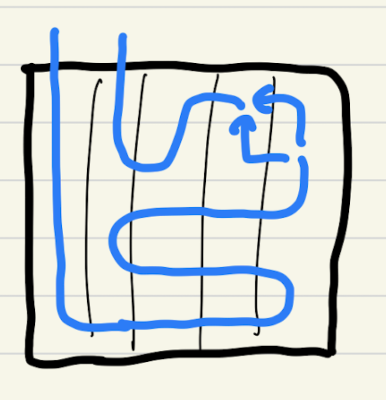
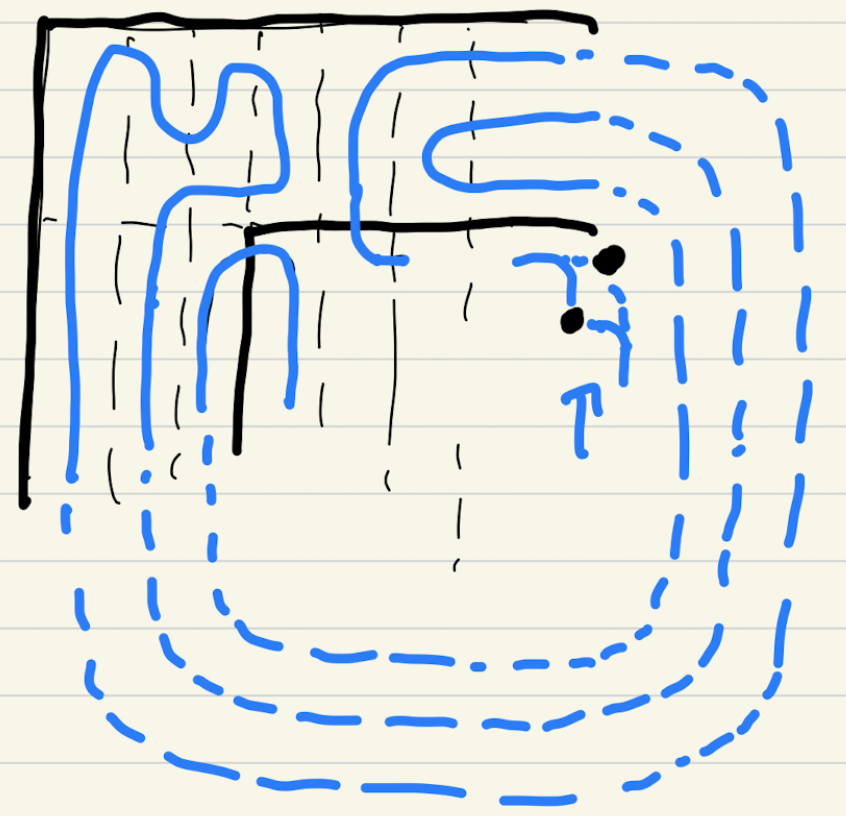

<br><br>

This weekend, I played multiple CTFs including

KnightCTF, Insomnihack, bi0sCTF.

<br>

KnightCTF challenges weren't so hard / high quality, so I just cleared 7 crypto challs, which required extremely low level knowledge about crypto, and stopped playing.

<br>

For Insomnihack, I was given a very few time to play, since my team was not really focusing on it, and was planning to focus on bi0sCTF which starts 3 hour later.

Despite, I was glad that I solved one crypto chall about GCM mode in AES.

<br>

Now about bi0sCTF, my team 'thehackerscrew' gladly finished top 1. I solved only 2 crypto challenges out of 4. Something worth remembering for me is that I first-blooded both challs. 

But it was not very twisted challenge anyway, just honest challs which easily shows the path to solving them. I wished that I could solve one more challenge called too-ec, but wasn't so familiar with the method.

<br><br>

## **leaky-dsa**

### **chall.sage**

```python
from Crypto.Util.number import *
from secret import flag
from hashlib import sha256

p = 0xffffffff00000001000000000000000000000000ffffffffffffffffffffffff
a = 0xffffffff00000001000000000000000000000000fffffffffffffffffffffffc
b = 0x5ac635d8aa3a93e7b3ebbd55769886bc651d06b0cc53b0f63bce3c3e27d2604b

E = EllipticCurve(GF(p), [a,b])
G = E.gens()[0]
q = G.order()
priv = Integer(bytes_to_long(flag))

def sign(msg, d):
    k = int.from_bytes(sha256(int(d).to_bytes(d.nbits()//8 + 1, 'big') + sha256(msg).digest()).digest(), 'big')
    z = int.from_bytes(sha256(msg).digest(),'big')
    r = int((k * G)[0]) % q
    s = (inverse_mod(k, q) * (z + d * r)) % q
    leak_k = (k >> 120) << 120
    return z, r, s, leak_k

for i in range(2):
    msg = input("Enter message: ").encode()
    print(sign(msg, priv))
```

<br>

It was an ecdsa challenge that gives upper bits of k.

Giving upper bits of k means that the unknown value is in a small range, and can perform a famous LLL attack.

<br>

Coppersmith works too, but I referenced this article: [https://eprint.iacr.org/2019/023.pdf](https://eprint.iacr.org/2019/023.pdf)

Implementation is not much hard.

There was no limit of number for allowed data, so I just chose 10.

### **ex.sage**

```python
from Crypto.Util.number import *
from hashlib import sha256
import json
from pwn import *
import time

p = 0xffffffff00000001000000000000000000000000ffffffffffffffffffffffff
a = 0xffffffff00000001000000000000000000000000fffffffffffffffffffffffc
b = 0x5ac635d8aa3a93e7b3ebbd55769886bc651d06b0cc53b0f63bce3c3e27d2604b

E = EllipticCurve(GF(p), [a,b])
G = E.gens()[0]

q = G.order()


num_data = 10
t_list = []
a_list = []
B_ = 2^120

for i in range(num_data // 2):
    io = remote("crypto.chall.bi0s.in", 10000)
    io.sendlineafter("Enter message: ", str(2 * i))
    data = io.recvline().decode()[1:-2].split(", ")

    data = [Integer(int(c)) for c in data]

    z, r, s, leak_k = data

    t_list.append((r / s) % q)
    a_list.append((-z / s + leak_k) % q)

    io.sendlineafter("Enter message: ", str(2 * i + 1))
    data = io.recvline().decode()[1:-2].split(", ")

    data = [Integer(int(c)) for c in data]

    z, r, s, leak_k = data

    t_list.append((r / s) % q)
    a_list.append((-z / s + leak_k) % q)

    io.close()

    print("done")

mat = []
for i in range(num_data):
    line = [0] * (num_data + 2)
    line[i] = q
    mat.append(line)
t_list.append(B_ / q)
t_list.append(0)
a_list.append(0)
a_list.append(B_)
mat.append(t_list)
mat.append(a_list)

mat = Matrix(mat).LLL()

ks = mat[1]

print(ks)

k = -ks[i]
y = ((k + a_list[i]) / t_list[i]) % q

print(long_to_bytes(y))
```

<br><br>

## **bad2code**

### **chall.sage**

```python
from Crypto.Util.number import *
from secrets import FLAG

assert len(FLAG) == 44
FLAG_FORMAT = "bi0s"

NBITS = len(FLAG)<<2

a = 0xBAD2C0DE
c = 0x6969
m = 1<<NBITS
seed = getRandomNBitInteger(NBITS)
state = seed

ciphertext = []

for i,f in enumerate(FLAG):
    state = (state*a+c)%m
    ciphertext.append((state>>(NBITS>>1))^^i^^ord(f))

public = [1]
for i in range(2, 91):
    public.append(public[-1]*i)
q = sum(public)
while True:
    r = getRandomInteger(100)
    if GCD(r, q) == 1:
        break

B = [r*i % q for i in public]

def encrypt(ct):
    blen = ct.bit_length()
    ct = bin(ct)[2:]
    ct = [int(i) for i in ct]
    ct = [ct[i]*B[i] for i in range(len(ct))]
    return blen, sum(ct)

ct = []
for i in ciphertext:
    ct.append(encrypt(i))

with open("ct.txt", "w") as f:
    f.write(str(ct))
print(r)
# r = 439336960671443073145803863477
```

I think the author wanted us to use LLL to get the binary values that are multipled to r\*factorials, but since they gave the r value already, by multiplying r's inverse to the final number, it isn't really needed.

Also sum of 0 ~ k th factorial is always smaller than k + 1 th factorial, so we can easily get the binary values and numbers.

<br>

The next step was finding the initial state from the known values.

With all the flag format infos, we theoretically could get significant half bits of 8 front values.

<br>

Getting the lower bits is the problem here.

The LCG is generated by multiplying 0xBAD2C0DE and adding 0x6969 every step.

With $k$th state's upper bits and $k + 1$th state's upper bits,

we can reveal the top of unknown bits of $k$th state.

This is pretty obvious because to match $a\*state + k$'s higher bits, state's lower half bits get to affect them.

~~(This is pretty nasty to read... I will learn LaTeX soon..)~~

(Gladly I learnt it now!!!!!!UwU)
<br><br>


So we can reveal around $a$'s bit\_length every step. It is around 30 bits, but I chose to reveal 22 bits everytime just to be safe.

### **ex.sage**

```python
from Crypto.Util.number import *

pubkey = [1]
for i in range(2, 91):
    pubkey.append(pubkey[-1]*i)
q = sum(pubkey)

data = {redacted}
r = 439336960671443073145803863477

datas = []

for i in range(44):
    val = 0

    v = (data[i][1] * pow(r, -1, q)) % q
    l = data[i][0]
    for j in range(l):
        if v >= pubkey[l - 1 - j]:
            v -= pubkey[l - 1 - j]
            val += 1 << j

    assert v == 0
    datas.append(val)

a = 0xBAD2C0DE
c = 0x6969
m = 1 << 176
flag_f = "bi0sc"
samples = []

for i in range(5):
    samples.append((datas[i] ^^ i ^^ ord(flag_f[i])) << 88)

for i in range(4, 0, -1):
    low_range = samples[i]
    high_range = samples[i] + (1 << (22 * i)) - 1
    add_low = (low_range - (samples[i - 1] * a + c) % m) // a
    add_high = (high_range - (samples[i - 1] * a + c) % m) // a

    print(add_low)
    print(add_high)

    #assert add_low >> (22 * (i - 1)) == add_high >> (22 * (i - 1))
    add = (add_low >> (22 * (i - 1))) << (22 * (i - 1))
    samples[i - 1] += add

    print("done")
samples[0] += 1
print(((samples[0]*a + c)%m) >> 22)
print(samples[1] >> 22)
assert ((samples[0]*a + c)%m) >> 22 == samples[1] >> 22


states = [samples[0]]

for i in range(43):
    states.append((a * states[i] + c) % m)

flag = ""
for i in range(44):
    c = (states[i] >> 88) ^^ datas[i] ^^ i
    flag += chr(c)

print(flag)
```

<br><br>

## **Unsolved: too-ec**

This was a challenge that we should get the value of 3 chunks that are redacted from p.

p was 512 bit length, and 3 chunks were 36, 40, 40 bit length, so the given bits were enough.

<br>

The problem was that those chunks weren't continuous, so we have to use multi-variabled coppersmith.

Thankfully my teammate kiona provided me a comparison from ConnorM, of 4 different method for this. [https://gist.github.com/Connor-McCartney/f107d91dea14a04e24db44090dee40de](https://gist.github.com/Connor-McCartney/f107d91dea14a04e24db44090dee40de)

<br>

Sadly, since it was a simple implementation of the original ones, none of the method seemed to work with 3 variables.

After the CTF ended, I found the author and mant solvers have used joseph's implementation to solve this.

[https://github.com/josephsurin/lattice-based-cryptanalysis/blob/main/lbc\_toolkit/problems/small\_roots.sage](https://github.com/josephsurin/lattice-based-cryptanalysis/blob/main/lbc_toolkit/problems/small_roots.sage)

<br>

Extreme respect for joseph, and 3 other authors of implementations also.

<br>

After recovering p1 with coppersmith, structing the curve and getting the order, and finally getting the hidden value of ecdsa is same as **leaky-dsa**.

<br><br>

## **\+ misc: Snek Game**

|


For this challenge, after CSN3RD explained about the challenge, I came up with some ideas that could make this work. Gladly, he understood it very well and did a great job on implementing it. GG!