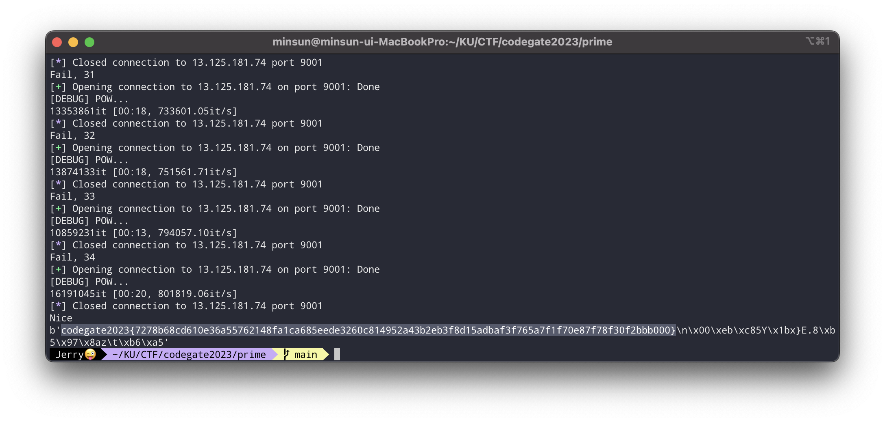
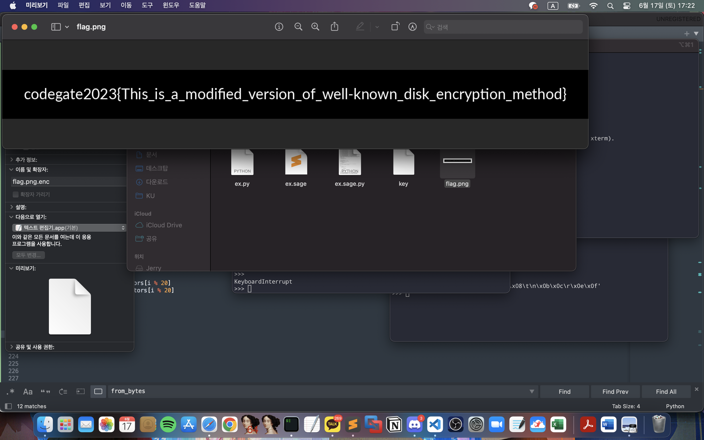
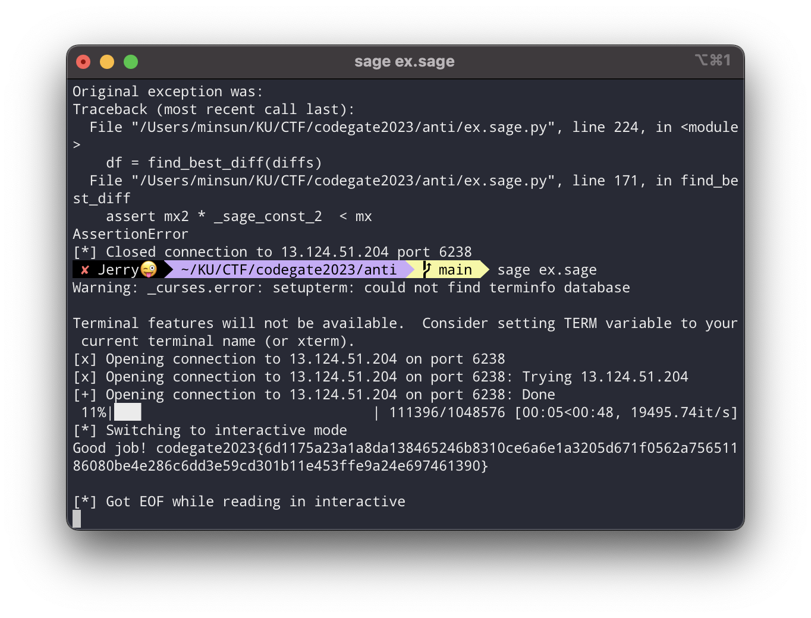

With Team "Корея! Ура!"

<br><br>

## crypto - secure primeGenerator

1. set에 원하는 수 하나에다가 음수를 끼워넣으면 30030으로 나눈 나머지가 고정되게 할 수 있다.
2. X에다가 enc_p, enc_q들의 곱 등을 끼워넣으면 원하는 항들을 더할 수 있다.

$p + q$ 가 30030으로 나눈 나머지가 1이 되게 하고 $p^2 + 2pq + q^2$를 전송하면 $N = (p + q)^2$가 된다.

flag를 복호화하기 위해서는 N을 완전히 소인수분해할 필요가 있는데(phi를 구하기 위해) 이는 임의의 30030으로 나눈 나머지가 1인 512비트 정수를 소인수분해하는 문제와 동일하다.

임의의 512비트 정수를 소인수분해하기는 쉽지 않지만, 작은 소수들(대충 50000 이하의 소수들로 설정하였다.)을 걸러낸 후에 남은 큰 수가 소수일 확률은 제법 높다. 될때까지 접속을 반복하면 된다. 필자는 34번만에 성공하였다.

<br>

### ex.py

```python
from pwn import *
from Crypto.Util.number import *
from hashlib import sha256
from math import isqrt
from itertools import product
from tqdm import tqdm
import random

small_primes = [n for n in range(50000) if isPrime(n)]

def POW(r):
    print("[DEBUG] POW...")
    b_postfix = r.recvline().decode().split(' = ')[1][6:].strip()
    h = r.recvline().decode().split(' = ')[1].strip()
    for brute in tqdm(product('0123456789abcdef', repeat=6)):
        b_prefix = ''.join(brute)
        b_ = b_prefix + b_postfix
        if sha256(bytes.fromhex(b_)).hexdigest() == h:
            r.sendlineafter(b' > ', b_prefix.encode())
            return True

    assert 0, "Something went wrong.."

def collect():

    # io = process(["python3", "prob.py"])
    io = remote("13.125.181.74", 9001)

    POW(io)

    io.recvuntil("SERVER_N = ")
    SERVER_N = int(io.recvline())
    io.recvuntil("SERVER_E = ")
    SERVER_E = int(io.recvline())

    io.sendlineafter("> ", "0")
    io.sendlineafter("> ", "0 -1")
    io.sendlineafter("> ", "0 -1 -2")
    io.sendlineafter("> ", "0 -1 -2 -3")
    io.sendlineafter("> ", "0 -1 -2 -3 -4 -5")
    io.sendlineafter("> ", "0 -1 -2 -3 -4 -5 -6")

    io.sendlineafter("> ", "1")
    io.sendlineafter("> ", "1 -1")
    io.sendlineafter("> ", "1 -1 -2")
    io.sendlineafter("> ", "1 -1 -2 -3")
    io.sendlineafter("> ", "1 -1 -2 -3 -4 -5")
    io.sendlineafter("> ", "1 -1 -2 -3 -4 -5 -6")

    # io.interactive()

    io.recvuntil("p1_enc = ")
    p1_enc = int(io.recvline())
    io.recvuntil("q1_enc = ")
    q1_enc = int(io.recvline())

    X = [0] * 12
    X[0] = p1_enc * q1_enc
    X[1] = p1_enc**2
    X[2] = q1_enc**2

    send_str = ""
    for x in X:
        send_str += f"{x} "

    io.sendlineafter("> ", send_str)

    if io.recv(1) != b"N":
        io.close()
        return None

    io.recvuntil(" = ")
    N = int(io.recvline())

    p1q1 = isqrt(N)

    assert p1q1**2 == N
    assert p1q1 % 30030 == 1

    for _ in range(20):
        io.recvuntil("b = ")
        b = int(io.recvline())

        send = sha256(long_to_bytes(pow(b, N+1-p1q1, N))).hexdigest()

        io.sendlineafter("> ", send)
        io.recvline()

    io.recvuntil("FLAG_ENC = ")
    FLAG_ENC = int(io.recvline())

    io.close()

    return p1q1, FLAG_ENC, N

if __name__ == "__main__":
    cnt = 0
    while 1:
        cnt += 1

        res = collect()
        if res == None:
            print(f"Fail, {cnt}")

            continue

        to_ft, FLAG_ENC, N = res

        ft_ = to_ft

        factored = {}

        for p in small_primes:
            while ft_ % p == 0:
                ft_ //= p

                if p in factored:
                    factored[p] += 2
                else:
                    factored[p] = 2

        if isPrime(ft_):
            print("Nice")
            factored[ft_] = 2

            chkN = 1

            for f in factored:
                chkN *= f**factored[f]

            phi = N

            for f in factored:
                phi //= f
                phi *= f - 1

            assert chkN == N

            d = pow(0x10001, -1, phi)

            r = random.randrange(0, 2**100)
            assert pow(r, phi, N) == 1
            assert pow(pow(r, 65537, N), d, N) == r

            flag = pow(FLAG_ENC, d, N)

            print(long_to_bytes(flag))

            break

        else:
            print(f"Fail, {cnt}")

```



<br><br>

## crypto - My File Encryptor

16바이트 AES 평문-암호문쌍 단 하나만 찾으면 끝나는 문제인데 굉장히 까다로웠다. 아주 즐겁게 풀었다.

먼저 16바이트 쌍을 찾으면 그 쌍을 nonce로 사용해서 LOCAL_NONCE를 평문으로 넣어서 암호화한 값을 구할 수 있고, 그 후에는 png.enc의 모든 블록들을 복호화할 수 있다. 비교적 간단한 작업이다. alpha만 조심해서 잘 끼워맞춰주면 된다.

그 쌍을 찾는 것이 즐거운 과정인데, AES가 등장하는 과정은 단 세군데: Nonce, encrypt, decrypt이다.

초기 alpha 생성과정에서 Nonce를 encrypt하고 index에 따라서 vector들을 곱해준다. 그런데 여기서 index가 모두 0이라서 Nonce가 그대로 alpha에 들어간다면? 평문에 제로벡터를 넣어줄 시 alpha를 바로 암호화하거나 복호화해준 후 alpha를 더해준다.

alpha = enc(nonce)일때 pt를 제로벡터로 설정하고 decryption을 한다면 결과는 dec(alpha) + alpha = nonce + enc(nonce)가 된다. nonce는 설정할 수 있고 아는 값이기 때문에 enc(nonce)를 구할 수 있고, 그럼 평문 암호문쌍이 완성된다.

문제는 index가 모두 0인걸 막아놓았다. 그래서 위의 시나리오를 위해서는 vector들의 곱이 GF에서 1이 되는 index를 구해야 하는데, sage의 log함수는 신이기 때문에 log값을 구해서 LLL을 통해 0 ~ 128의 지수값들을 구할 수 있다.

<br>

### ex.sage

```python
from Crypto.Util.number import *
from tqdm import trange

def from_bytes(b: bytes):
    assert len(b) <= 16
    return int.from_bytes(b, "little")

f = open("vectors", "rb")

PR = PolynomialRing(GF(2), name="x")
x = PR.gens()[0]

MOD = 0x19F2BBF3EF3A2AB6684710EB139F3A9AD
mod = 0
for i in range(129):
    if (1 << i) & MOD:
        mod += x^i

# print(mod.factor())

RR.<y> = GF(2^128, modulus = mod)

order = 2^128 - 1

'''
logs = []

for i in trange(20):
    res = from_bytes(f.read(16))

    poly = 0

    for i in range(128):
        if (1 << i) & res:
            poly += y^i

    lg = poly.log(y)

    assert y^lg == poly

    logs.append(lg)

print(logs)
'''

logs = [261629215884968183250147230743308139720, 146763262680157608582681047563221463841, 248784953788949551730643566865051631345, 286526998085427350642696392793987108979, 337130451241049551486878529918354476213, 53783408201406459759500543258549075610, 306599076482132954196702434345038388563, 55924177656411356635629632114800095804, 338975693492727317490680903467492741591, 277778985401527636120352138591790653938, 73659742778090454015560355748813149930, 127360915233179511640436507880391757673, 25944160787380095532958838192153719808, 319707435256954289749190071566764343902, 237896358261335633716025723673820938776, 306341259411304056188890964520942162642, 327274174516648181703234931814645063977, 143955049917637004208574424592046114166, 19908498241827604230094235308190396710, 231608557939739353780423517362565640365]

M = Matrix(22, 22)

weight = 2^32

for i in range(20):
    M[i, i] = 1
    M[i, 20] = logs[i] * weight

    M[20, 20] += 64 * logs[i] * weight

M[21, 20] = (2^128 - 1) * weight

chk = 2^40
M[20, 21] = chk

M = M.LLL()

res = []

for v in M:
    if v[21] == chk:
        for i in range(20):
            res.append(ZZ(64 + v[i]))

fin_chk = 0

for i in range(20):
    fin_chk += logs[i] * res[i]
    fin_chk %= (2^128 - 1)

assert fin_chk == 0

from file_crypto import FileCipher, random_index, index_to_bytes, index_from_bytes, GF

cipher = FileCipher()

chk_poly = GF(1)

for i in range(20):
    chk_poly *= cipher.vectors[i]^res[i]

assert chk_poly.v == 1

# print(res)
res = index_to_bytes(res)

# print(res)
# print(index_from_bytes(res))

from pwn import *
import base64
import os

io = remote("13.125.18.170", 9137)

io.sendlineafter("mode? ", "dec")

nonce = os.urandom(16)

io.sendlineafter("nonce? ", base64.b64encode(nonce))
io.sendlineafter("index? ", base64.b64encode(res))
io.sendlineafter("data? ", base64.b64encode(b"\\x00" * 16))

enc_nonce = xor(base64.b64decode(io.recvline()[:-1]), nonce)

# print(len(enc_nonce))

io.close()

local_nonce = bytes(range(16))

to_send = xor(local_nonce, enc_nonce)

io = remote("13.125.18.170", 9137)

io.sendlineafter("mode? ", "enc")

io.sendlineafter("nonce? ", base64.b64encode(nonce))
io.sendlineafter("index? ", base64.b64encode(res))
io.sendlineafter("data? ", base64.b64encode(to_send))

enc_local_nonce = xor(base64.b64decode(io.recvline()[:-1])[:16], enc_nonce)

# print(enc_nonce)
# print(enc_local_nonce)

io.close()

f = open("flag.png.enc", "rb")

f.read(16)
index_bytes = index_from_bytes(f.read(20))

# print(index_bytes)

server_alpha = GF.from_bytes(enc_nonce)
local_alpha = GF.from_bytes(enc_local_nonce)

for i in range(20):
    local_alpha *= cipher.vectors[i]**index_bytes[i]

ct = b""

blocks = 640

for i in range(blocks):
    block = f.read(16)

    to_send = local_alpha + server_alpha + GF.from_bytes(block)

    ct += GF.to_bytes(to_send)

    local_alpha *= cipher.vectors[i % 20]
    server_alpha *= cipher.vectors[i % 20]

io = remote("13.125.18.170", 9137)

io.sendlineafter("mode? ", "dec")

io.sendlineafter("nonce? ", base64.b64encode(nonce))
io.sendlineafter("index? ", base64.b64encode(res))
io.sendlineafter("data? ", base64.b64encode(ct))

pt = base64.b64decode(io.recvline()[:-1])

io.close()

real_pt = b""

server_alpha = GF.from_bytes(enc_nonce)
local_alpha = GF.from_bytes(enc_local_nonce)

for i in range(20):
    local_alpha *= cipher.vectors[i]**index_bytes[i]

for i in range(blocks):
    blk = pt[16 * i:16 * (i + 1)]

    pt_blk = local_alpha + server_alpha + GF.from_bytes(blk)
    real_pt += GF.to_bytes(pt_blk)

    local_alpha *= cipher.vectors[i % 20]
    server_alpha *= cipher.vectors[i % 20]

f = open("flag.png", "wb")
f.write(real_pt)

f.close()

```



<br><br>

## crypto - anti Kerckhoffs

문제를 단계별로 설명하도록 하겠다.

1. sbox1 2차다항식에서 x^2의 계수는 중간에 있는 행렬에 몰아줄 수 있다.
2. 그래서 sbox1을 x^2 + ax + b, 다르게 쓰면 (x + a)^2 + b로 표현 가능해서 어떤 x값 쌍에 대해서 같은 결과를 내는지를 확인하면 a를 구할 수 있다.
3. 약간 좌표계를 이동?하는 느낌으로 2의 식을 x^2 + b로 극단적으로 간편화가 가능하다. x에 0 ~ 9의 값만 들어간다고 사실상 생각하는 것이 좋다, 음수의 제곱은 동일하기 때문이다.
4. 이제 3의 식을 두 벡터로 그냥 쪼개버린다. 하나는 [x0^2, x1^2 …], 하나는 [b0, b1, …]로 표현한다. b벡터는 상수이기 때문에 가운데 행렬을 곱한 후에도 그냥 상수행렬이 될 것이다. 우리는 target을 맞춰주는 것이 목표가 아니라 target에 비트가 적중할 때의 정보를 모아서 nullspace를 더하는 느낌으로 할 것이라서 b벡터의 곱이 사실 상관없다.
5. x^2의 값이 17개 중 9개밖에 존재하지 않는 것이 굉장히 치명적이다. 그래서 두 인덱스를 골라서 9 * 9 = 81가지를 돌려서 같은 비트가 target과 일치하는 경우를 찾고, 그 차분을 구하면 nullspace라고 할 수 있다. 두 인덱스만이 0이 아니고, 나머지는 모두 0이기 때문에 행렬의 row에서 해당하는 두 인덱스에 대해 하나가 다른 하나의 몇 배인지를 알 수 있다. 이를 19회 반복하면 row를 복구할 수 있다. row의 한 인덱스를 1로 픽스해버리면 마음이 편하다. 어차피 Sbox2에 곱해줘버린 것과 동치이기에 이렇게 생각이 가능하다. 필자는 19(마지막)번째 인덱스를 1로 fix했다.
6. 사실 5는 틀렸다. Sbox2에서도 결괏값이 17개가 아니라 9개밖에 없어서 일대일대응이 아니기 때문이다. 그래서 임의의 두 입력 인덱스의 차분을 구하면 절반 확률로 엉뚱한 값이 나온다. (두 벡터들의 차가 nullspace이거나 두 벡터들의 합이 특정 벡터를 만족하면 Sbox2를 통과하고 같은 결과를 가진다.) 다행히 절반 확률로는 올바른 차분이 나오기 때문에 구한 차분들 중에서 가장 많이 등장하는 친구를 고르면 된다.
7. 5에서 말한 것과 같이 row들을 모두 복구해서 matrix를 완전히 복구하면 sbox2에 들어가기 직전 상태까지의 계수들은 모두 알 수 있다. 각 비트별로 만족하는 input들을 sbox1, matrix에 통과시키면 2개 또는 1개의 값으로 항상 수렴한다. 1개인 경우 중근인 것으로 생각할 수 있다. 즉 많아야 2^20개의 가능 후보가 존재하고, 중근인 경우 보너스로 두배씩 줄어든다. 가운데의 행렬을 알기 때문에 역행렬을 곱해주면 초기 input을 알 수 있다. 초기 input의 모든 20개의 값들이 제곱수 9개에 일치하는지 확인해주면서 전수조사를 하면 된다. 얼마 걸리지도 않는다.

이건 python으로 되겠지 하다가 결국은 행렬 등장해서 sage로 바꿔줬다.

<br>

### ex.sage

```python
from pwn import *
import random
from tqdm import trange

MOD = 17
m = 20
tot_used = 0

def int_to_list(x):
    assert 0 <= x < MOD ** m, "Invalid int format"
    L = [0] * m
    for i in range(m):
        L[i] = x % MOD
        x //= MOD
    return L

def list_to_int(L):
    assert len(L) == m, "Invalid list format"
    assert all(0 <= x < MOD for x in L), "Invalid list format"
    ret = 0
    for i in range(m):
        ret += L[i] * MOD ** i
    return ret

def sendmul(send):
    global tot_used
    tot_used += len(send)

    send_str = ""
    for s in send:
        send_str += f"{s} "
    send_str = send_str[:-1]

    io.sendlineafter("> ", send_str)

    io.recvuntil("Outputs = ")

    output = io.recvline().decode()[:-2].split(" ")
    output = [int(o) for o in output]

    return output

def half(a):
    if a % 2 == 0:
        return a // 2
    return (a + 17) // 2

def sendmul_including_a(send):
    send_a = []
    for s in send:
        s_list = int_to_list(s)

        for i in range(20):
            s_list[i] -= half(a[i])
            s_list[i] %= 17

        send_a.append(list_to_int(s_list))

    return sendmul(send_a)

TEST = True
if TEST:
    io = process(["python3", "prob-13.py"])
else:
    io = remote("13.124.51.204", 6238)

io.recvuntil("TARGET = ")
target = int(io.recvline())

if TEST:
    Sbox1 = eval(io.recvline())
    mat = eval(io.recvline())

    # print(Sbox1)

    for i in range(20):
        for j in range(20):
            mat[j][i] *= Sbox1[i][2]
            mat[j][i] %= 17

to_send = []

payload_len = 100

for _ in range(payload_len):
    to_send.append(random.randrange(0, 17**20))

res = sendmul(to_send)

nice = []

for i in range(payload_len):
    if res[i] & 1:
        nice.append(to_send[i])

chk_len = len(nice)

possibilities = [[1] * 17 for _ in range(20)]

a = [0] * 20

for i in range(20):
    for k in range(chk_len):
        to_send_list = []
        base_send = int_to_list(nice[k])

        for j in range(17):
            to_send = base_send[:]
            to_send[i] = j
            to_send_list.append(list_to_int(to_send))

        # print(to_send_list)

        res = sendmul(to_send_list)

        for j in range(17):
            if j == base_send[i]:
                assert res[j] & 1
                continue

            if res[j] & 1 == 0:
                idx = (-(base_send[i] + j)) % 17
                possibilities[i][idx] = 0

    assert sum(possibilities[i]) == 1

    for j in range(17):
        if possibilities[i][j] == 1:
            a[i] = j

# print(tot_used)

'''

rand_list = int_to_list(random.randrange(0, 17**20))
print(sendmul_including_a([list_to_int(rand_list)]))

for i in range(17):
    if random.randrange(0, 2) == 0:
        rand_list[i] = (-rand_list[i]) % 17

print(sendmul_including_a([list_to_int(rand_list)]))

'''

def find_best_diff(diffs):
    diff_cp = diffs[:]
    diff_cp.sort()

    # print(diffs)
    # print(diff_cp)

    mx = diff_cp[-1]
    mx2 = diff_cp[-2]

    assert mx2 * 2 < mx
    assert 5 < mx
    # print(mx2, mx)

    for i in range(17):
        if diffs[i] == mx:
            assert i != 0
            return i

middle_mat = [[0] * 20 for _ in range(20)]

for idx in range(19):

    to_send = []

    for i in range(81):
        send_list = [7] * 20
        send_list[idx] = i // 9
        send_list[19] = i % 9

        to_send.append(list_to_int(send_list))

    res = sendmul_including_a(to_send)

    for bit in range(20):

        col = []

        for i in range(81):
            if res[i] & (1 << bit):
                a_, b_ = [i // 9] + [i % 9]
                asq = (a_**2) % 17
                bsq = (b_**2) % 17
                col.append([asq, bsq])

        l_col = len(col)

        diffs = [0] * 17

        for i in range(l_col):
            for j in range(i + 1, l_col):
                diff = [(col[i][0] - col[j][0]) % 17, (col[i][1] - col[j][1]) % 17]

                if diff[0] == 0 or diff[1] == 0:
                    continue

                diff = (pow(diff[0], -1, 17) * diff[1]) % 17

                diffs[diff] += 1

        # print(diffs)

        df = find_best_diff(diffs)

        middle_mat[bit][idx] = 17 - df

        middle_mat[bit][19] = 1

if TEST:
    # print(middle_mat)
    # print(mat)

    for i in range(20):
        for j in range(19):
            assert (middle_mat[i][j] * mat[i][19]) % 17 == mat[i][j]

to_send = []

payload_len = 500

for i in range(payload_len):
    send = [random.randrange(0, 9) for _ in range(20)]

    to_send.append(list_to_int(send))

res = sendmul_including_a(to_send)

iter_val = 1

res_list = []

for bit in range(20):
    added = []
    for j in range(payload_len):
        if res[j] & (1 << bit):
            add = 0

            lst = int_to_list(to_send[j])

            for k in range(20):
                add += lst[k]**2 * middle_mat[bit][k]
                add %= 17

            added.append(add)

    added = list(set(added))
    assert len(added) <= 2

    # print(added)
    res_list.append(added)

    iter_val *= len(added)

middle_mat = Matrix(GF(17), middle_mat)
mat_inv = middle_mat.inverse()

for i in trange(iter_val):
    v = vector(GF(17), 20)

    bit_idx = 0

    for j in range(20):
        if len(res_list[j]) == 1:
            v[j] = res_list[j][0]

        else:
            v[j] = res_list[j][(i >> bit_idx) & 1]
            bit_idx += 1

    res = mat_inv * v

    chk_vals = [0, 1, 4, 9, 16, 8, 2, 15, 13]

    suc = True
    for k in res:
        if ZZ(k) not in chk_vals:
            suc = False
            break

    if suc:
        # print("Yay")
        ans_vec = res

        break

ssqrt = {0:0, 1:1, 4:2, 9:3, 16:4, 8:5, 2:6, 15:7, 13:8}

ans = [ssqrt[k] for k in ans_vec]

sendmul_including_a([list_to_int(ans)])

io.interactive()
```

