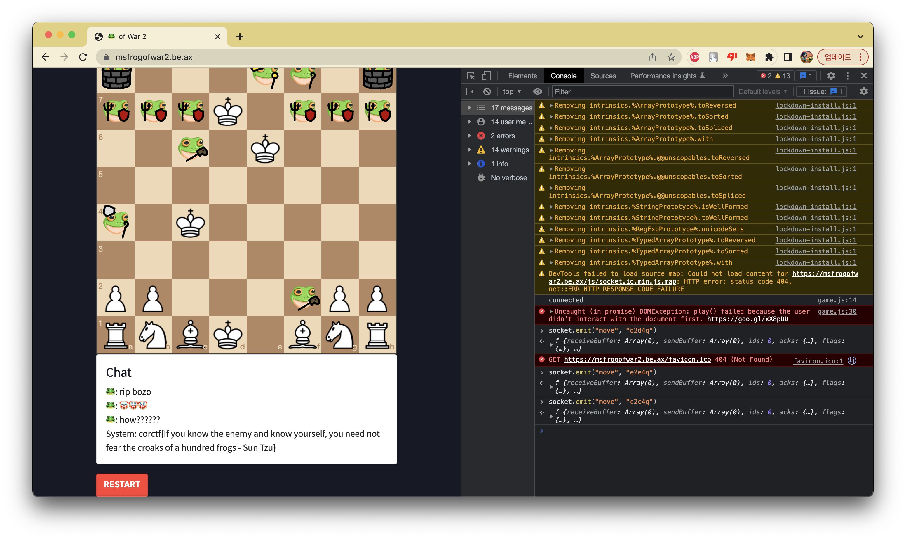

With Team "cat :flag_kr:"

<br><br>

## crypto - eyes

### main.sage

```python
from Crypto.Util.number import bytes_to_long, getPrime

# my NEW and IMPROVED secret sharing scheme!! (now with multivariate quadratics)

with open('flag.txt', 'rb') as f:
    flag = f.read()

s = bytes_to_long(flag)
p = getPrime(len(bin(s)))
print(p)
F = GF(p)
N = 1024

conv = lambda n: matrix(F, N, 1, [int(i) for i in list(bin(n)[2:][::-1].ljust(N, '0'))])

A = random_matrix(F, N, N)

for i in range(0, N):
    for j in range(0, i):
        A[i, j] = 0
B = random_matrix(F, N, 1)
C = matrix(F, [F(s)])

fn = lambda x: (x.T * A * x + B.T * x + C)[0][0]

L = []
for i in range(7):
    L.append(fn(conv(i + 1)))

print(L)
```


This is a challenge that constructs a 1024 * 1024 matrix on GF(p).

And we know the result of some result of front multiplication and back multiplication combined.

That gives us info about 9 values inside matrix `A`.

<br>

Playing with those values easily leaves us the flag value.

### ex.py

```python
p = ...
L = [...]

L = [0] + L

flag = ((L[7] - L[1] - L[2] - L[4]) - (L[3] - L[1] - L[2]) - (L[5] - L[1] - L[4]) - (L[6] - L[2] - L[4])) % p

from Crypto.Util.number import *
print(long_to_bytes(flag))
```

`corctf{mind your ones and zeroes because zero squared is zero and one squared is one}`

<br><br>

## crypto - fizzbuzz100

### fizzbuzz100.py
```python
#!/usr/local/bin/python
from Crypto.Util.number import *
from os import urandom

flag = open("flag.txt", "rb").read()
flag = bytes_to_long(urandom(16) + flag + urandom(16))

p = getPrime(512)
q = getPrime(512)
n = p * q
e = 0x10001
d = pow(e, -1, (p-1)*(q-1))
assert flag < n
ct = pow(flag, e, n)

print(f"{n = }")
print(f"{e = }")
print(f"{ct = }")

while True:
    ct = int(input("> "))
    pt = pow(ct, d, n)
    out = ""
    if pt == flag:
        exit(-1)
    if pt % 3 == 0:
        out += "Fizz"
    if pt % 5 == 0:
        out += "Buzz"
    if not out:
        out = pt
    print(out)
```

We can easily decrypt flag from the case when flag isn't a multiple of 3 or 5.

### ex.py
```python
from pwn import *

io = remote("be.ax", 31100)

io.recvuntil("n = ")
n = int(io.recvline())
io.recvuntil("e = ")
e = int(io.recvline())
io.recvuntil("ct = ")
ct = int(io.recvline())

to_send = pow(2, e, n) * ct
to_send %= n

io.sendline(str(to_send))

io.recvuntil("> ")

flag_2 = int(io.recvline())

from Crypto.Util.number import *

print(long_to_bytes(flag_2 // 2))

io.interactive()
```

`corctf{h4ng_0n_th15_1s_3v3n_34s13r_th4n_4n_LSB_0r4cl3...4nyw4y_1snt_f1zzbuzz_s0_fun}`


<br><br>

## crypto - fizzbuzz101

### fizzbuzz101.py
```python
#!/usr/local/bin/python
from Crypto.Util.number import *
from os import urandom

flag = open("flag.txt", "rb").read()
flag = bytes_to_long(urandom(16) + flag + urandom(16))

p = getPrime(512)
q = getPrime(512)
n = p * q
e = 0x10001
d = pow(e, -1, (p-1)*(q-1))
assert flag < n
ct = pow(flag, e, n)

print(f"{n = }")
print(f"{e = }")
print(f"{ct = }")

while True:
    ct = int(input("> "))
    pt = pow(ct, d, n)
    out = ""
    if pt == flag:
        exit(-1)
    if pt % 3 == 0:
        out += "Fizz"
    if pt % 5 == 0:
        out += "Buzz"
    if not out:
        out = "101"
    print(out)
```

Now, the result doesn't give any information of the decrypted flag, except for whether it's divisable with 3, 5.

This is a famous LSB oracle challenge, but I always ironically had a difficult time implementing it :((

<br>

We can know whether `flag * k` is divisible of 3 or 5. I was surprised that FizzBuzz is an actual existing thing with the same rule.

My idea was to reconnect until flag is relatively prime to 15.

When I know `[flag * k, flag * (k + 1) ... flag * (k + 14)]`, exactly one of them must result to "FizzBuzz". With that we can discover (flag * k) % 15.

Of course, we don't know the result for `flag % 15`, so we have to try all 8 (`[1, 2, 4, 7, 8, 11, 13, 14]`) cases.

<br>

Only one case out of 8 possibility has the possible root.

<br>

### ex.py
```python
from pwn import *
from Crypto.Util.number import *
from tqdm import tqdm, trange

io = remote("be.ax", 31101)
# io = process(["python3", "fizzbuzz101.py"])

io.recvuntil("n = ")
n = int(io.recvline())
io.recvuntil("e = ")
e = int(io.recvline())
io.recvuntil("ct = ")
ct = int(io.recvline())

io.sendlineafter("> ", str(ct * pow(2, e, n)))
if b"zz" in io.recvline()[:-1]:
    print("unlucky")
    exit()

def get10(to_send):
    l = len(to_send)

    for k in to_send:
        for i in range(15):
            io.sendline(str((pow(k + i, e, n) * ct) % n))

    ret = []
    for t in range(l):
        res = io.recvlines(15)

        for i in range(15):
            if b"FizzBuzz" in res[i]:
                ret.append((15 - i) % 15)
                break
    assert len(ret) == l
    return ret

def get(to_send):
    res = []
    tt_send = to_send[:]
    while len(tt_send):
        print(len(tt_send))
        res.extend(get10(tt_send[:10]))
        tt_send = tt_send[10:]

    return res

tot_len = 1000

to_send = []

for i in range(tot_len):
    to_send.append(2**(i + 1))

res = get(to_send)


bs = [1, 2, 4, 7, 8, 11, 13, 14]

res_ind = []
for i in range(8):
    res_ind.append([])

for i in range(tot_len):
    for j in range(8):
        res_ind[j].append((res[i] * bs[j]) % 15)

for i in range(8):
    st = 0

    cur = res_ind[i]

    suc = True

    for j in range(tot_len - 1):
        new_st = (cur[j] * 2 - cur[j + 1]) % 15

        if new_st > 1:
            suc = False
            break

        st = 2 * st + new_st

    if suc:
        print(st)
        flag = st * n // 2**tot_len

        print(long_to_bytes(flag))


io.interactive()
```

`corctf{''.join(fizz_buzz(x) for x in range(99, 102)) == "FizzBuzz101" == cool_username}`

<br><br>

## crypto - fizzbuzz102

### fizzbuzz102.py
```python
#!/usr/local/bin/python
from Crypto.Util.number import *
from os import urandom
from secrets import randbits

flag = open("flag.txt", "rb").read()
flag = bytes_to_long(urandom(16) + flag + urandom(16))

p = getPrime(512)
q = getPrime(512)
n = p * q
e = 0x10001
d = pow(e, -1, (p-1)*(q-1))
assert flag < n
ct = pow(flag, e, n)

a = randbits(845)
b = randbits(845)
b = 15 * (b // 15)

while a % 3 == 0 or a % 5 == 0:
    a += 1

def lcg(x):
    return (a * x + b) % n

print(f"{n = }")
print(f"{e = }")
print(f"{ct = }")
print(f"{a = }")

while True:
    ct = int(input("> "))
    pt = lcg(pow(ct, d, n))
    out = ""
    if pt == flag:
        exit(-1)
    if pt % 3 == 0:
        out += "Fizz"
    if pt % 5 == 0:
        out += "Buzz"
    if not out:
        out = "101"
    print(out)
```

Now, LCG is added to fizzbuzz101.

I struggled a bit at first, but we can solve this one totally freely with applying 101's method two times.

`b` shifts result mod 15, and I was too lazy to deal with all cases, so I just reconnected until `b % 15 == 0`.

<br>

First, we can discover `a`, because we can know `k * a`'s fizzbuzz result, it is exactly same with 101.

Second, by multiplying inverse of a when sending, the second step is exactly same with 101 too.

<br>

Both `a` and `flag` has to be relatively prime to 15, so the success rate is (1/15) * (8/15)^2.

Which is around 1/60.

<br>

### ex.py
```python
from pwn import *
from Crypto.Util.number import *
from tqdm import tqdm, trange

TEST = False

if TEST:
    io = process(["python3", "fizzbuzz102.py"])
else:
    io = remote("be.ax", 31102)

io.recvuntil("n = ")
n = int(io.recvline())
io.recvuntil("e = ")
e = int(io.recvline())
io.recvuntil("ct = ")
ct = int(io.recvline())
if TEST:
    io.recvuntil("a = ")
    a = int(io.recvline())

io.sendlineafter("> ", str(0))
if b"FizzBuzz" not in io.recvline()[:-1]:
    print("unlucky")
    exit()

io.sendlineafter("> ", str(1))
if b"101" not in io.recvline()[:-1]:
    print("unlucky")
    exit()

def get10(to_send):
    l = len(to_send)

    for k in to_send:
        for i in range(15):
            io.sendline(str(pow(k + i, e, n)))

    ret = []
    for t in range(l):
        res = io.recvlines(15)

        for i in range(15):
            if b"FizzBuzz" in res[i]:
                ret.append((15 - i) % 15)
                break
    # print(to_send)
    # print(ret)
    assert len(ret) == l
    return ret

def get(to_send):
    res = []
    for i in trange((len(to_send) + 9) // 10):
        res.extend(get10(to_send[i * 10:i * 10 + 10]))
        # print(len(res))

    return res

tot_len = 1200

to_send = []

for i in range(tot_len):
    to_send.append(2**(i + 1))

res = get(to_send)


bs = [1, 2, 4, 7, 8, 11, 13, 14]

res_ind = []
for i in range(8):
    res_ind.append([])

for i in range(tot_len):
    for j in range(8):
        res_ind[j].append((res[i] * bs[j]) % 15)

for i in range(8):
    st = 0

    cur = res_ind[i]

    suc = True

    for j in range(tot_len - 1):
        new_st = (cur[j] * 2 - cur[j + 1]) % 15

        if new_st > 1:
            suc = False
            break

        st = 2 * st + new_st

    if suc:
        mya = st * n // 2**tot_len
        if st * n % 2**tot_len > 2**tot_len // 2:
            mya += 1

        break

if TEST:
    assert mya == a

a = mya


def get10_flag(to_send):
    l = len(to_send)

    for k in to_send:
        for i in range(15):
            io.sendline(str(pow(k + i, e, n) * pow(a, -e, n) * ct))

    ret = []
    for t in range(l):
        res = io.recvlines(15)

        for i in range(15):
            if b"FizzBuzz" in res[i]:
                ret.append((15 - i) % 15)
                break
    # print(to_send)
    # print(ret)
    assert len(ret) == l
    return ret

def get_flag(to_send):
    res = []
    for i in trange((len(to_send) + 9) // 10):
        res.extend(get10_flag(to_send[i * 10:i * 10 + 10]))
        # print(len(res))

    return res


io.sendlineafter("> ", str(ct * pow(2, e, n) * pow(a, -e, n)))
if b"zz" in io.recvline()[:-1]:
    print("unlucky")
    exit()


tot_len = 1200

to_send = []

for i in range(tot_len):
    to_send.append(2**(i + 1))

res = get_flag(to_send)


bs = [1, 2, 4, 7, 8, 11, 13, 14]

res_ind = []
for i in range(8):
    res_ind.append([])

for i in range(tot_len):
    for j in range(8):
        res_ind[j].append((res[i] * bs[j]) % 15)

for i in range(8):
    st = 0

    cur = res_ind[i]

    suc = True

    for j in range(tot_len - 1):
        new_st = (cur[j] * 2 - cur[j + 1]) % 15

        if new_st > 1:
            suc = False
            break

        st = 2 * st + new_st

    if suc:
        flag = st * n // 2**tot_len
        if st * n % 2**tot_len > 2**tot_len // 2:
            flag += 1

        print(long_to_bytes(flag))

        break


io.interactive()
```

`corctf{fizzbuzz_1s_4_r4th3r_s1lly_f0rm_0f_l34k4g3_d0nt_y0u_th1nk?n0w_w1th_4dd3d_LCG_f0r_fun!}`

<br><br>

## crypto - QCG-k

### qcgk.py
```python
from random import randint
from Crypto.Util.number import inverse, bytes_to_long
from Crypto.Util.Padding import pad
from Crypto.Cipher import AES
from hashlib import sha256
import os

class PRNG:
    def __init__(self, mod):
        self.coeffs = [randint(1,mod) for _ in range(16)]
        self.mod = mod
        self.state = randint(1, mod)
    def next(self):
        self.state = sum(coeff * self.state**i for i,coeff in enumerate(self.coeffs)) % self.mod
        return self.state

q = 77897050769654696452572824710099972349639759246855689360228775736949644730457
p = ...
g = ...

x = randint(1, q - 1)
y = pow(g,x,p)

kPRNG = PRNG(q)

def hsh(msg):
    return bytes_to_long(sha256(msg).digest())

def sign(msg):
    k = kPRNG.next()
    r = pow(g,k,p) % q
    s = (inverse(k, q) * (hsh(msg) + x*r)) % q
    if r == 0 or s == 0:
        return sign(msg)
    return r,s

with open("quotes.txt") as f:
    for quote in f:
        quote = quote.strip().encode()
        print(sign(quote))

key = sha256(str(x).encode()).digest()
iv = os.urandom(16)
cipher = AES.new(key, AES.MODE_CBC, iv)
flag = open("flag.txt", "rb").read()
enc = cipher.encrypt(pad(flag,16))
print(enc.hex())
print(iv.hex())
```

We are given with 17 linear equations with 16 unknown constant coefficients.

And we can represent all values in the equations as polynomial of `x` on `F`.

All coefficients for each equation is equal, so making it as RREF, last row has to be row of zero.

<br>

Then M[16, 16] is a polynomial of `x`, but has to be equal to 0, so iterating the polynomial's all roots by factoring gives us the flag.

<br>

### ex.sage
```python
from random import randint
from Crypto.Util.number import *
from Crypto.Util.Padding import pad
from Crypto.Cipher import AES
from hashlib import sha256
from tqdm import trange


def hsh(msg):
    return bytes_to_long(sha256(msg).digest())

hs = []

with open("quotes.txt") as f:
    for quote in f:
        quote = quote.strip().encode()

        hs.append(hsh(quote))

q = 77897050769654696452572824710099972349639759246855689360228775736949644730457
p = ...
g = ...

F = GF(q)

P.<x> = PolynomialRing(F)

f = open("out-4.txt", "r")

k = []

for i in range(18):
    r, s = eval(f.readline())
    h = hs[i]

    k.append((h + x * r) / s)

M = []
res = []

for i in range(17):
    line = []
    for j in range(16):
        line.append(k[i]^j)
    line.append(k[i + 1])
    M.append(line)

for i in trange(16):
    for j in range(i + 1, 17):
        to_mul = M[j][i]

        for k in range(17):
            M[j][k] = M[i][i] * M[j][k] - to_mul * M[i][k]

for i in range(16):
    assert M[16][i] == 0

xs = []

for fac in list(M[16][16].factor()):
    f, _ = fac
    if f.degree() >= 2:
        continue

    x = int(-f[0])

    key = sha256(str(x).encode()).digest()
    iv = bytes.fromhex("bf549fa30bef66988268f357e1014c8d")
    ct = bytes.fromhex("5c9d830f422288b4a9a37dc6b1cf68bfb7ee1acadb428d9fee6b17a8b8cbc5e7d871314bf090e4faa083d68162414b72992a60119ceb9c67f928d224f44f14c5")
    cipher = AES.new(key, AES.MODE_CBC, iv)

    flag = cipher.decrypt(ct)

    if b"corctf{" in flag:
        print(flag)
```

`corctf{wh4t_d0_y0u_m34n_1_C4Nt_jU5t_4dd_m0re_c03FFs?!??!?!????}`

It is basically the same, but alternative possible solution is to calculate the determinant, and finding roots of it.

<br><br>

## misc - msfrogofwar2

My teammate `boo` discovered that, by sending `socket.emit("move", "b2b4Q")` to the console transforms pawn into king.

But we couldn't transform pawns into queens.

With 9 kings the winning rate is almost 100% already, but the problem is 20 turns limit.

<br>

Fortunately I managed to avoid frog's castling, and made a checkmate in 10 turns.



`corctf{If you know the enemy and know yourself, you need not fear the croaks of a hundred frogs - Sun Tzu}`

<br><br>

## misc - touch-grass


:))

`corctf{i_hope_you_d1dnt_have_a_gr4ss_allergy}`


