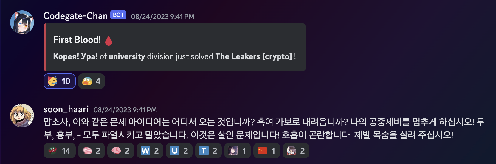

With Team "Корея! Ура!"

Final position: 2nd

  

I solved only one challenge, but the fact that I was the only solver makes me feel really really good.

The challenge name was `The Leakers`(crypto), and the solution is nicely explained in the author(rkm0959)'s blog.

The concept for the challenge was amazing, never saw this kind of Mersenne Twister challenge before.

 

Thankfully, he also explained my solution for Task 1 too.

[CODEGATE 2023 Finals - The Leakers (1 solve)](https://rkm0959.tistory.com/293)

 

  

Here is my solve code: [Solve](https://github.com/soon-haari/soon-haari.github.io/tree/master/files/codegatefinals/solve)

`ex.sage` to solve, and the code for generating the seed is in `mersenne` folder.

Thanks `rkm0959` for the challenge, but moreover, really thanks to my teammates `jinh`, `justlikebono`, `sqrtrev`.