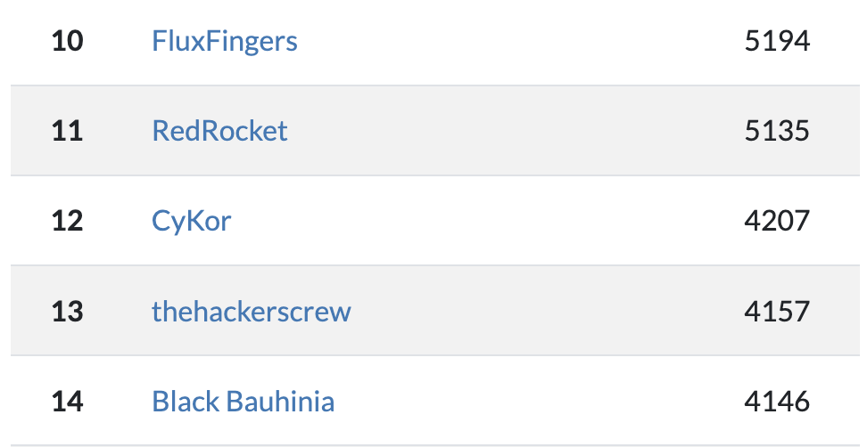
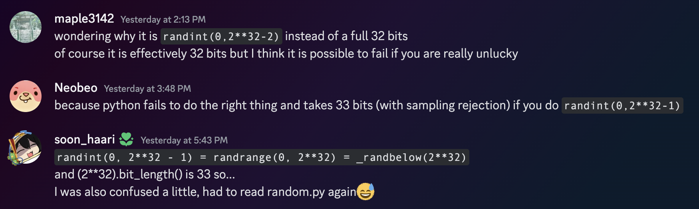
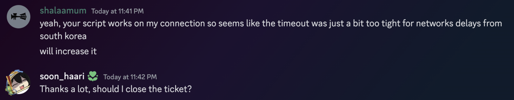

I played KalmarCTF 2024 with my univ club CyKor.



I think we did great considering the number of active members, and there was something to celebrate for myself. 

I will write a write-up for challenges I solved/upsolved.

Thanks to everyone on Kalmarunionen for the CTF.

<br><br>

## Crypto - Cracking The Casino (69 solves)

The challenge's goal was to predict the randomness of a commitment.

Dice mode, card mode, and debug mode exist, and debug mode can reveal consecutive `random.getrandbits(32)` with a very high probability every round. Gather the information 624 times, untemper them, and setting state is enough to predict later outputs.

Solve code: [ex.py](https://github.com/soon-haari/soon-haari.github.io/blob/master/files/kalmar/casino/ex.py)



I think it's worth sharing a short conversation about `random.randint(0, 2**32 - 2)`.

<br><br>

## Crypto - Re-Cracking The Casino (27 solves)

The previous challenge permitted the user to resign, but this time user has to win 250+ times out of 256, so the previous solution cannot work.

However, if `g`'s multiplicative order is smaller than `h`'s multiplicative order, it is possible to get some information about `r` from commitment.
```python
def commit(pk, m):
    q, g, h = pk
    r = randint(1,q-1)

    comm = pow(g,m,q) * pow(h,r,q)
    comm %= q

    return comm,r
```
Setting `r`'s possible range as small as possible(dice mode) can recover `r`'s value if `g`'s order is at least 6 times smaller than `h`'s order.

It depends on luck setting `g, h`, so I reconnected like a few hundred times.

Solve code: [ex.sage](https://github.com/soon-haari/soon-haari.github.io/blob/master/files/kalmar/casino2/ex.sage)

<br>

After reading some discussion after CTF ended, I realized the range check (`if not (x > 1 and x < q):`) was a bug, which made the challenge slightly more difficult.
```python
def verify(param, c, r, x):
    q, g, h = param
    if not (x > 1 and x < q):
        return False
    return c == (pow(g,x,q) * pow(h,r,q)) % q
```

<br><br>

## Crypto - MathGolf-Warmup (32 solves)

The challenge was to generate a normal form from a recurrence relation which looks like this:

<center>$s_n = as_{n - 1} + bs_{n - 2} \pmod p$</center>

Fortunately, I was quite familiar with solving recurrence relations, maybe thanks to [Functional(2022 ICC Athens)](https://soon.haari.me/functional-icc-athens-2022/).

However, finding $k$ which makes $s_n + ks_{n - 1} = (a + k)s_{n - 1} + bs_{n - 2} \pmod p$'s both sides the same ratio wasn't so easy and realized that's all $p$'s fault.

Fortunately(again, lol), the challenge itself gave a hint about using $\mathbb{F}_{p^2}$, I might have struggled more without it.

Solve code: [ex.sage](https://github.com/soon-haari/soon-haari.github.io/blob/master/files/kalmar/golf/ex.sage)

<br>

Fun fact: I couldn't still solve the challenge due to a time limit. The challenge required the user to pass 100 rounds, but with my environment(mostly network packet issues) it was not possible.

However, after making a ticket, the author(shalaamum) handled the issue in the kindest way possible.




<br><br>

## (Upsolved) Misc - A Blockchain Challenge (19 solves)

I realized this challenge exists after spending too much time working on 0 solves crypto challs(**Which was \*\*\*\*ing worth it**), so only 2 hours was allowed for me to solve this.

After *very slow code-reading*, coming up with a solution didn't take too long, however after *very slow code-writing*, minor bugs appeared and I couldn't manage to finish it within 2 hours.

- Start with some accounts generated, like 10 ~ 20.
- If one of the accounts succeeds in hitting the block, get it, or tick.
- Make sure to generate some more accounts when enough budgets are filled.

After finishing something more important, I fixed the code.

Solve code: [ex.py](https://github.com/soon-haari/soon-haari.github.io/blob/master/files/kalmar/block/ex.py)

<br><br>

## (Upsolved) Crypto - poLy1305CG (0 solves)

Someone said *short-coded crypto challenges are the scariest*.

No one including me could solve the challenge during the CTF. And the hint released afterward also didn't really help me, but at least I got the courage I was in the correct way from it. Turns out my solution was unintended haha. 

After solving it, I was so thrilled, that I bought dinner for some colleagues who stayed next to me.

Check it out: [x.com](https://x.com/___ahpuh/status/1769649755934888092)


### chal.py
```python
#!/usr/bin/env python3

from Crypto.Hash import Poly1305
from Crypto.Cipher import ChaCha20
import os

N = 240
S = 10
L = 3
I = 13


# "Poly1305 is a universal hash family designed by Daniel J. Bernstein for use in cryptography." - wikipedia
def poly1305_hash(data, Key, Nonce):
    hsh = Poly1305.new(key=Key, cipher=ChaCha20, nonce=Nonce)
    hsh.update(data=data)
    return hsh.digest()

# If i just use a hash function instead of a linear function in my LCG, then it should be super secure right?
class PolyCG:
    def __init__(self):
        self.Key = os.urandom(32)
        self.Nonce = os.urandom(8)
        self.State = os.urandom(16)
        

        # Oops.
        print("init = '" + poly1305_hash(b'init', self.Key, self.Nonce)[:I].hex() + "'")

    def next(self):
        out = self.State[S:S+L]
        self.State = poly1305_hash(self.State, self.Key, self.Nonce)
        return out

if __name__ == "__main__":
    pcg = PolyCG()
    v = []
    for i in range(N):
        v.append(pcg.next().hex())
    print(f'{v = }')

    key = b"".join([pcg.next() for _ in range(0, 32, L)])[:32]
    cipher = ChaCha20.new(key=key, nonce=b'\0'*8)
    flagenc = cipher.encrypt(b"kalmar{}")
    print(f"flagenc = '{flagenc.hex()}'")
```

After surfing the internet a bit, I made a pseudocode of poly1305 hash, and started solving.

```python
from Crypto.Hash import Poly1305
from Crypto.Cipher import ChaCha20
import os

def poly1305_hash(data, key, nonce):
    hsh = Poly1305.new(key=key, cipher=ChaCha20, nonce=nonce)
    hsh.update(data=data)
    return hsh.digest()

def divceil(a, b):
    return (a + b - 1) // b

def mypoly1305_hash(data, key, nonce):
    rs = ChaCha20.new(key=key, nonce=nonce).encrypt(b'\x00' * 32)
    r, s = rs[:16], rs[16:]

    r = int.from_bytes(r, "little")
    s = int.from_bytes(s, "little")
    r &= 0x0ffffffc0ffffffc0ffffffc0fffffff
    P = 0x3fffffffffffffffffffffffffffffffb

    res = 0
    for i in range(0, divceil(len(data), 16)):
        block = data[i*16:(i+1)*16] + b'\x01'
        res += int.from_bytes(block, "little")
        res = (r * res) % P
    res += s
    res %= 2**128
    res = res.to_bytes(16, "little")
    return res

for _ in range(10):
    msg = os.urandom(os.urandom(1)[0])
    key = os.urandom(32)
    nonce = os.urandom(8)
    res = poly1305_hash(msg, key, nonce)
    res2 = mypoly1305_hash(msg, key, nonce)

    assert res == res2
```

### 1. Setting the goal
Poly1305 works pretty much the same as normal LCG.
128 bit $r, s$ is set initially, and the result is calculated on a modulus $p = 2^{130} - 5$.

In this challenge, in which every hash calculation depended on one block, it can be written as the following:

<center>$hash(a) = ar + s \pmod p$</center>

So we know partial information about LCG's output consecutively, and there is an attack about it called *Stern's attack*([eprint.iacr.org](https://eprint.iacr.org/2021/1204)).

I recently learned about this attack thanks to [RBTree's challenge](https://dreamhack.io/wargame/challenges/1032) for KAPO(POKA) CTF which was authored by [Dreamhack](https://dreamhack.io/).

So we can conclude we can recover $r$ from outputs' partial pieces of information with Stern's attack.

<br><br>

**...OR IS IT???**
```python
    for i in range(0, divceil(len(data), 16)):
        block = data[i*16:(i+1)*16] + b'\x01'
        res += int.from_bytes(block, "little")
        res = (r * res) % P
    res += s
    res %= 2**128
```
After calculating the result on $\bmod p$, the hashing algorithm only returns 128 LSB, to make the hash 16 bytes long.

Specifically, $(0 \sim 4) \times 2^{128}$ is subtracted after calculating $ar + s \pmod p$.

We can write it this way:
<center>$hash(a) = ar + s - (0 \sim 4) \times 2^{128} \pmod p$</center>

LCG's important property is broken, but I will continue and review this when it's time to use Stern's attack.

<br><br>

### 2. Making the unknowns consecutive (Unintended)
We can see hash is represented to bytes with little-endian, and only `hash[10:13]` is revealed.

So when $k$ is the known 3 bytes of $h$ value, we can write it like this:

<center>$h = a + 2^{80}k + 2^{104}b \pmod p, (0 \leq a < 2^{80}, 0 \leq b < 2^{24})$</center>

Because $p = 2^{130} - 5$, I thought it was possible to make two error variables into one larger error variable by multiplying some.

This is the result after multiplying $2^{26}$.

<center>$2^{26}h = 2^{26}a + 2^{106}k + 2^{130}b = 2^{26}a + 2^{106}k + 5b\pmod p$</center>
<center>$= 2^{106}k + c \pmod p, (0 < c \leq 2^{106})$</center>

<br>

I will rewrite this in a more general form. $s_i$ represents the small error ($0 \sim 4$) I mentioned in the previous step.

- $h_{i + 1} = a_{i + 1} + 2^{80}k_{i + 1} + 2^{104}b_{i + 1} = rh_i + s - 2^{128}s_i \pmod p$
- $h_{i + 2} = a_{i + 2} + 2^{80}k_{i + 2} + 2^{104}b_{i + 2} = rh_{i + 1} + s - 2^{128}s_{i + 1} \pmod p$

<br>

- $h_{i + 1} - h_{i + 2} = (a_{i + 1} - a_{i + 2}) + 2^{80}(k_{i + 1} - k_{i + 2}) + 2^{104}(b_{i + 1} - b_{i + 2})$
- $h_{i + 1} - h_{i + 2} = r(h_i - h_{i + 1}) + 2^{128}(s_{i + 1} - s_{i})$

I will redefine some values.
- $H_i = h_{i} - h_{i + 1}$
- $A_i = a_{i} - a_{i + 1}, (-2^{80} < A_i < 2^{80})$
- $B_i = b_{i} - b_{i + 1}, (-2^{24} < B_i < 2^{24})$
- $S_i = s_{i} - s_{i + 1}, (-4 \leq S_i \leq 4)$
- $K$ represents every known values like $2^{80}(k_{i} - k_{i + 1})$ from now on.

<center>$H_i = A_i + 2^{104}B_i + K$</center>
<center>$H_{i + 1} = rH_i + 2^{128}S_i$</center>
<br>
<center>$2^{26}H_i = 2^{26}A_i + 2^{130}B_i + K = C_i + K$</center>
<center>$2^{26}H_{i + 1} = r2^{26}H_i + 2^{130} \times 2^{24}S_i = r2^{26}H_i + 5 \times 2^{24}S_i$</center>

After defining $P_i = 2^{26}H_i, \; t = 5 \times 2^{24}$, the final equations are made.

<center>$P_i = C_i + K, (-2^{106} < C_i < 2^{106})$</center>
<center>$P_{i + 1} = rP_i + tS_i, (-4 \leq S_i \leq 4)$</center>

Now the goal is to recover $r$ from $N - 1 = 239$ infos about $P_i = C_i + K$.

<br><br>

### 3. Why does Stern's attack work???

Let's review Stern's attack.

<center>$\begin{bmatrix} v_0 & v_1 & v_2 & \cdots  & v_{d - 1} \end{bmatrix} \times \begin{bmatrix} P_0 & rP_0 & r^2P_0 & r^3P_0 & \cdots \\ P_1 & rP_1 & r^2P_1 & r^3P_1 & \cdots \\ P_2 & rP_2 & r^2P_2 & r^3P_2 & \cdots \\ \vdots & \vdots & \vdots & \vdots & \ddots \\ P_{d - 1} & rP_{d - 1} & r^2P_{d - 1} & r^3P_{d - 1} & \cdots \\ \end{bmatrix}$</center>
<br>
<center>$= \begin{bmatrix} D & RD & R^2D & R^3D & \cdots \end{bmatrix} , \; D = v_0P_0 + v_1P_1 + \cdots + v_{d - 1}P_{d - 1}$</center>

Stern's attack succeeds by finding small vector $\begin{bmatrix} v_0 & v_1 & v_2 & \cdots  & v_{d - 1} \end{bmatrix}$ satisfying $D = 0$. 

$\begin{bmatrix} P_0 & P_1 & P_2 & \cdots  & P_{d - 1} \end{bmatrix}$'s $d$ values are pretty big and random, but there is only one constraint so we can expect vectors with elements' size around $p^{\frac{1}{d}}$.

<br>

What about the current case?

<center>$
\begin{matrix}
\begin{bmatrix} v_0 & v_1 & v_2 & \cdots \end{bmatrix} \\

\times 

\begin{bmatrix} 
P_0 & rP_0 + tS_0 & r^2P_0 + rtS_0 + tS_1 & r^3P_0 + r^2tS_0 + rtS_1 + rS_2 & \cdots\\ 
P_1 & rP_1 + tS_1 & r^2P_1 + rtS_1 + tS_2 & r^3P_1 + r^2tS_1 + rtS_2 + rS_3 & \cdots\\ 
P_2 & rP_2 + tS_2 & r^2P_2 + rtS_2 + tS_3 & r^3P_2 + r^2tS_2 + rtS_3 + rS_4 & \cdots\\ 
\vdots & \vdots & \vdots & \vdots & \ddots\\ 
\end{bmatrix} 
\end{matrix}$</center>

Is it possible for some vector $\begin{bmatrix} v_0 & v_1 & v_2 & \cdots \end{bmatrix}$ to make the upper multiplied result a zero vector?

The result looks like this, and I'm sure you might notice the pattern:
<center>$
\begin{matrix}
[ (v_0P_0 + v_1P_1 + v_2P_2 + \cdots), \\ 
r(v_0P_0 + v_1P_1 + v_2P_2 + \cdots) + t(v_0S_0 + v_1S_1 + v_2S_2 + \cdots), \\ 
r^2(v_0P_0 + v_1P_1 + v_2P_2 + \cdots) + rt(v_0S_0 + v_1S_1 + v_2S_2 + \cdots) + t(v_0S_1 + v_1S_2 + v_2S_3 + \cdots), \\ 
\cdots ]
\end{matrix}$</center>

Every term is linearly constructed with $(v_0P_0 + v_1P_1 + v_2P_2 + \cdots)$, and
- $(v_0S_0 + v_1S_1 + v_2S_2 + \cdots)$
- $(v_0S_1 + v_1S_2 + v_2S_3 + \cdots)$
- $(v_0S_2 + v_1S_3 + v_2S_4 + \cdots)$
- $(v_0S_3 + v_1S_4 + v_2S_5 + \cdots)$
- $ \cdots$ .

Unlike $(v_0P_0 + v_1P_1 + v_2P_2 + \cdots)$, making $(v_0S_? + v_1S_? + v_2S_? + \cdots)$ zero is very easy because every $S_i$ is extremely small($-4 \sim 4$)! Even though there are many constraints to satisfy, it is not hard.

<br>

In conclusion, we can apply Stern's attack directly to this challenge too. With well-set parameters, finding working vectors for $\begin{bmatrix} v_0 & v_1 & v_2 & \cdots \end{bmatrix}$ isn't very hard. We finally can calculate $r$.

<br><br>

### 4. The rest of the challenge

From 13 lower bytes of $hash("init")$, we can recover lower 104 bits of $s$. We can write $s = 2^{104}s_a + s_0$ and also can represent the initial state with $s_a$ after some observation.

There are only $2^{24}$ possibilities for $s_a$, so brute-forcing until LCGs are in good shape and decryption results in a good-looking flag can solve the challenge.

Thanks to Lance Roy for the challenge.

<br>

My super dirty solve code: [ex.sage](https://github.com/soon-haari/soon-haari.github.io/blob/master/files/kalmar/poly/ex.sage)

<br>

- My solution is unintended, it will be awesome to study the [Author's solution](https://github.com/kalmarunionenctf/kalmarctf/tree/main/2024/crypto/PolyCG1305/solution) too.
- Special thanks to Genni, I rearranged my solution yesterday while talking with him. He thinks every column sharing the same constraints isn't so magical after understanding. :\(