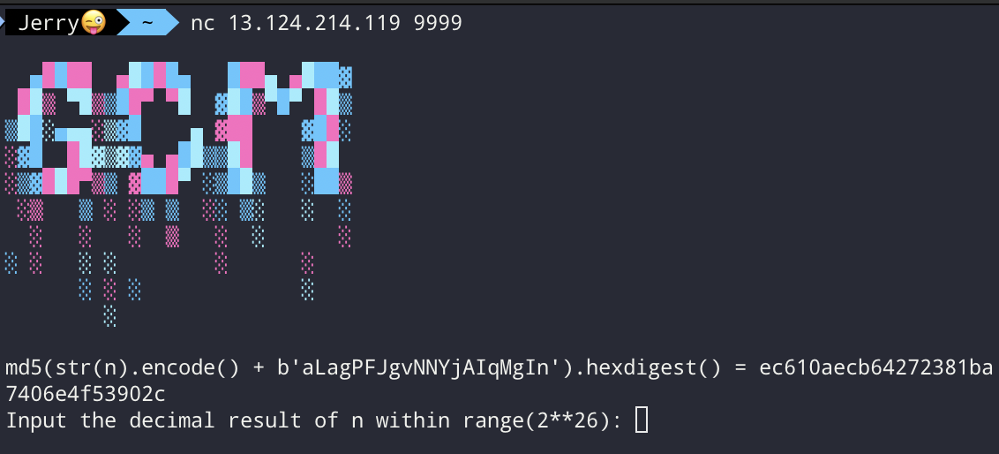
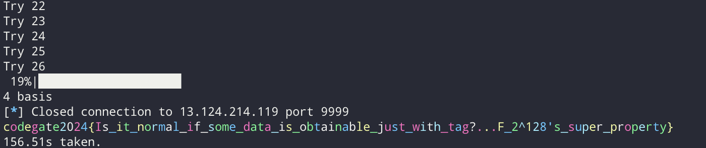

I authored a challenge for [Codegate Finals](https://codegate.org/), and the CTF was 
ended with one solve for this challenge.

Congrats to [ks](https://x.com/ksprsk_) from CyKor, for being the only solver!

Simple solution explanation in Korean: [README.md](https://github.com/soon-haari/my-ctf-challenges/blob/main/2024-codegate/%5BCrypto%5D-%5BGreatest-Common-Multiple%5D/README.md)

<br>

### Description
```
My boss 1nteger_c said we will come back with a better GCM challenge.
I hereby present, the Greatest Common Multiple.
```

As you can see, it is the mixture of the mathematical terms GCD(Greatest Common Divisor) and LCM(Least Common Multiple) :)

### chall.py
```python
from Crypto.Cipher import AES
from os import urandom
from signal import alarm
from secret import PoW, flag

PoW(26)
alarm(30)

gen = lambda: urandom(12)
randbit = lambda: gen()[0] & 1

key, nonce = urandom(16), gen()

new = lambda: AES.new(key, AES.MODE_GCM, nonce)
s = [gen(), gen()]

while cmd := input("> "):
    if cmd == "tag":
        cipher = new()
        cipher.update(s[0])
        cipher.encrypt(s[1])
        print(f"tag: {cipher.digest().hex()}")

    elif cmd == "u1":
        s[randbit()] = gen()

    elif cmd == "u2":
        s[randbit()] += gen()

if input(f"tag: ") == new().digest().hex():
    print(flag)
```

Only 578 bytes, that's pretty neat :D

Also shoot, this is an awesome `PoW` function with some art!


<br>

### Step 0. Yet another GCM challenge? Piece of cake!

This is another simple GCM challenge! These helper functions must be useful so that we can start with them. I will assume all the readers know how GCM tag calculation works.

Otherwise, you might want to try `Forbidden Fruit` in [Cryptohack - AES](https://cryptohack.org/challenges/aes/) and play with pseudocode in [RBTree's blog](https://rbtree.blog/posts/2022-03-27-sage-script-for-aes-gcm/).
```python
# Helper

F.<a> = GF(2^128, modulus=x^128 + x^7 + x^2 + x + 1)
mod = 2^128 + 2^7 + 2^2 + 2 + 1

def bytes_to_n(b):
    v = int.from_bytes(nullpad(b), 'big')
    return int(f"{v:0128b}"[::-1], 2)

def bytes_to_poly(b):
    return F.from_integer(bytes_to_n(b))

def poly_to_n(p):
    v = p.to_integer()
    return int(f"{v:0128b}"[::-1], 2)
    
def poly_to_bytes(p):
    return poly_to_n(p).to_bytes(16, 'big')

def length_block(lad, lct):
    return int(lad * 8).to_bytes(8, 'big') + int(lct * 8).to_bytes(8, 'big')

def nullpad(msg):
    return bytes(msg) + b'\x00' * (-len(msg) % 16)

def calculate_tag(key, ct, nonce, ad):
    y = AES.new(key, AES.MODE_ECB).encrypt(bytes(16))
    s = AES.new(key, AES.MODE_ECB).encrypt(nonce + b"\x00\x00\x00\x01")
    assert len(nonce) == 12
    # I was lazy to find one for other length nonces, not really needed for this challenge

    y = bytes_to_poly(y)

    l = length_block(len(ad), len(ct))

    blocks = nullpad(ad) + nullpad(ct)
    bl = len(blocks) // 16

    blocks = [blocks[16 * i:16 * (i + 1)] for i in range(bl)]
    blocks.append(l)
    blocks.append(s)

    tag = F(0)
    
    for exp, block in enumerate(blocks[::-1]):
        tag += y^exp * bytes_to_poly(block)

    tag = poly_to_bytes(tag)

    return tag

def check():
    key = os.urandom(16)
    nonce = os.urandom(12)

    ad = os.urandom(os.urandom(1)[0])
    pt = os.urandom(os.urandom(1)[0])
    
    cipher = AES.new(key, AES.MODE_GCM, nonce)
    cipher.update(ad)
    ct, tag = cipher.encrypt_and_digest(pt)

    assert tag == calculate_tag(key, ct, nonce, ad)
```

<br>

### Step 1. Getting $y$: Wait something is missing...

Unlike other GCM challenges, only tags are obtainable in this challenge.

So let's arrange what we can do, and what's our goal.

- "u1": set one of s[0] or s[1] to random bytes of length 12.
- "u2": add 12 random bytes to s[0] or s[1].
- "tag": calculate the tag result of s[0] as associated data, and s[1] as plaintext.
    - If you are familiar with GCM, you would probably know the tag is calculated through something like the following.

<center>
$t = s + \text{lengthblock} * y + \text{ct}_0 * y^2 + \text{ct}_1 * y^3 + \text{ad}_0 * y^4 + \text{ad}_1 * y^5$
</center>

Goal: Calculate the $s$.

<br>

The most important part of this challenge is noticing that 96 new binary variables are added for every "u1" or "u2" operation, because it's new 12 bytes, and 128 new binary equations are added since we get the 16-byte tag.

So theoretically with many tags, we can get more equations than the number of unknown variables, and solve the entire linear system.

But how does that work, and how can we know it gives linear equations? Let's find out by calculating $y$ ourselves, with the only "u1" option.

<br>

The probability is $\frac{1}{2}$, but let's just assume "u1" always updates the plaintext. GCM mode is a stream cipher, so ciphertexts are always plaintexts $\oplus$ some value. Note that the byte length of plaintext and ciphertext are always the same.

Also, their length is 12 bytes, so they rely on only one block each, and the length block stays constant.

<center>
$t_1 = s + \text{l} * y + \text{ct}_1 * y^2 + \text{ad} * y^3$
</center>

<center>
$t_2 = s + \text{l} * y + \text{ct}_2 * y^2 + \text{ad} * y^3$
</center>

<center>
$t_1 + t_2 = (\text{ct}_1 + \text{ct}_2) * y^2$
</center>

<center>
$(t_1 + t_2) * y^{-2} = \text{ct}_1 + \text{ct}_2$
</center>

We know the value of $(t_1 + t_2)$ and we also know $\text{ct}_1 + \text{ct}_2$ are 12 bytes. 

Which means upper 32 bits coefficients of $\text{ct}_1+\text{ct}_2$ are all 0, bingo!

<br>

But still, how can we make some linear equations from this?

Yeah, we usually will need some extremely dirty LLL for these kinds of things, when it's on a modulus ring. However, this is on $\mathbb{F}_{2^{128}}$, let's explore it's property.

Let $y^{-2} = a_0 + a_1 * x + \cdots + a_{127} * x^{127} = \sum_{i = 0}^{127} a_ix^i$.

Then, 

<center>
$$\sum_{i = 0}^{127} a_i * \left ( (t_1 + t_2) * x^i \right ) = \text{ct}_1 + \text{ct}_2$$
</center>

Since every 128 $\left ( (t_1 + t_2) * x^i \right )$ are known constant, we can calculate them into $\mathbb{F}_{2^{128}}$ elements, then we can easily see the 32 linear equations.

Gather as many diff-info as you can, and randomly pick 5 of them(4 * 32 = 128 so 4 is enough, but it has some probability to be singular, so I chose 5 to be safe.) until all 5 diffs are plaintexts or all 5 diffs are associated data. We can then recover $y^{-2}$ (or $y^{-3}$) 's all 128 coefficients with simple linear equation solving and finally get $y$.

The timeout is 20s, but this step shouldn't take much of it.

```python
def solve1():
    cur = tag()
    dats = []

    num_dat = 150
    io.sendlines([b"u1", b"tag"] * num_dat)

    for _ in range(num_dat):
        io.recvuntil(b"tag: ")
        new = bytes.fromhex(io.recvline().decode())

        dat = xor(new, cur)
        cur = new

        dat = bytes_to_n(dat)
        basis = [dat]
        for i in range(127):
            basis.append(basis[-1] << 1)
            if basis[-1] & (1 << 128):
                basis[-1] ^^= mod
        
        vecs = []
        for i in range(32):
            vecs.append(vector(GF(2), [basis[j] >> (i + 96) for j in range(128)]))

        dats.append(vecs)

    found = set()

    while True:
        idxs = random.sample(range(num_dat), 5)

        M = []
        for idx in idxs:
            M += dats[idx]
        M = Matrix(M)

        basis = M.right_kernel().basis()

        if len(basis) == 1:
            res = F([int(t) for t in basis[0]])
            
            found.add(res)
            
            if len(found) == 2:
                break

    f1, f2 = list(found)

    y = 1 / f1.sqrt()
    if y^(-3) == f2:
        return y

    y = 1 / f2.sqrt()
    assert y^(-3) == f1

    return y
```

<br>

### Step 2. Getting $s$: We are half done, how hard can it be...

Knowing $y$ makes our situation a whole lot better.

Let's look at the tag equation again.

<center>
$t = s + \text{l} * y + \text{ct} * y^2 + \text{ad} * y^3$
</center>

We still can't calculate $s$ because we can only calculate the diff of two ct or the diff of two ad, but not separately.

We have no other way than to make ct & ad into multiple blocks using "u2", which sounds dirty because 96 new variables are gained every time, and we don't even know if pt(ct) is updated or ad is updated.

Yeah, it's dirty. We initially have 128($s$) + 96(ct) + 96(ad) variables, and 128 equations(tag), so 192 more variables compared to equations. One "u2" operation can reduce the difference by 32, so we need at least 6 times.

When we actually try implementing it, we can learn that 6 is not enough from the experimental result.

If ct(or ad)'s length reaches 36 bytes and turns into 48, we can see the block position of previous variables stays the same. 

```
prev:
|----------------|----------------|----------------|
 1111111111112222 2222222233333333 3333~~~~~~~~~~~~   (~ means nullpad here)
new:
|----------------|----------------|----------------|
 1111111111112222 2222222233333333 3333444444444444
```

In this case, the tag diff is literally 444444444444 times $y^{\text{something}}$ (plus some length_block * $y$), which means we only retrieve 96 bits of 444444444444 from 128 equations from the tag.

So when ct(ad)'s size becomes 36 to 48, we can't reduce the difference by 32, and we need more "u2" trials than 6.

- And we have to brute-force if the ad's changed or ct's changed.

So we have to construct, `solve_right` for matrices sized like 1000x1000, more than 256 times for brute force. It's not doable in 20s.

<br>

### Step 3. Is it really solvable in 20s...?

I would say there must be a lot of ways to efficiently brute-force in 20s. For example, you can preprocess all the big-sized matrices, and inverse them, because multiplying takes way less time than solve_right. However, I will explain my different solution.

- We can always reset the ad and ct to 12 bytes by spamming "u1". So we can also retry until *something good* happens.
    - By *something good*, if we can quickly check something, and if it passes, we know what it's been through(ct or ad). If it doesn't, we spam "u1".

So we do "u2" 6 times. It will either extend ct or ad 12 bytes 6 times.

And now, we are actually using the property we said earlier: extension just covering the nullpad when the length is 36 -> 48.

When it happens, the latest two tags' difference divided by $y^{\text{something}}$'s upper 32 coefficients will be 0, which cannot randomly happen. And this check can be done very fast because it doesn't require a 1000x1000 matrix at all.

So we are looking for the following cases:
- (ct, ct, ct, ad, ad, ad)
- or (ad, ad, ad, ct, ct, ct)

which will happen with $\frac{2}{64} = \frac{1}{32}$ probability and it's good enough.

Afterward, we can "u2" like 5 times, because $2^5$ solve_right brute force is done in a pretty reasonable time.

<br>

Voilà, we did "u2" 11 times and gathered so much data with only 32 times brute force. That's a lot of reduction compared to $2^{11}$ brute-forcing.

- Oh right, even if we gather 32 more equations than variables which sounds sufficient, the nullspace's rank is 0, 2, 4, 6, 8... for some reason. Which means if the rank is 4, we have $\frac{1}{2^4}$ probability to get it right :pepega:
    - Timeout and nullspace are the main reasons we have to run the solve script more than once, maybe even automate it like mine.
<br>



Enjoy the colorful flag, and thanks for reading.

<br>

My full solve code: [ex.sage](https://github.com/soon-haari/my-ctf-challenges/blob/main/2024-codegate/%5BCrypto%5D-%5BGreatest-Common-Multiple%5D/exploit/ex.sage)
