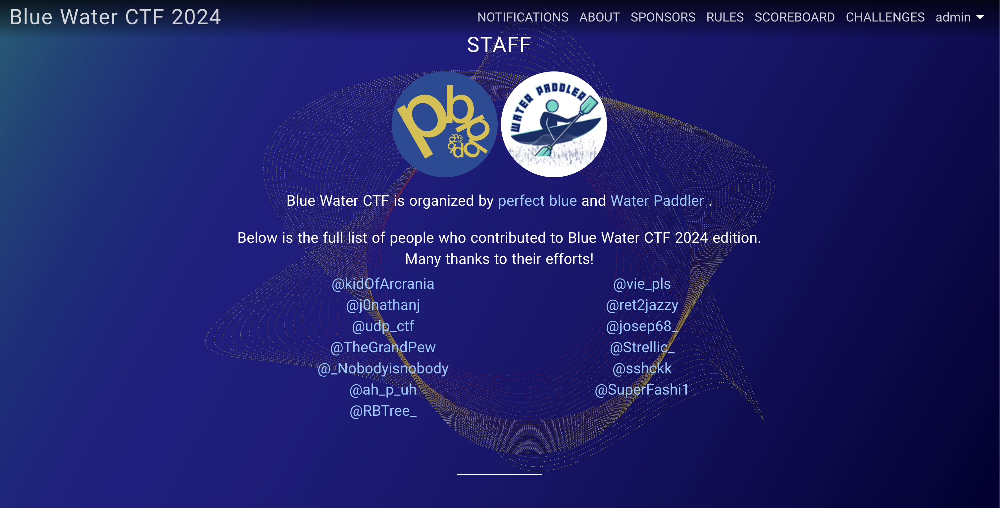
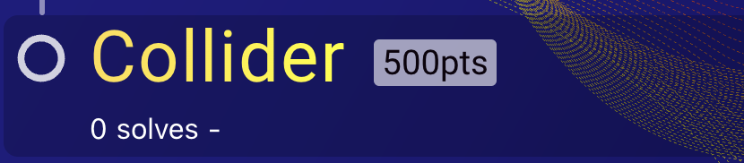
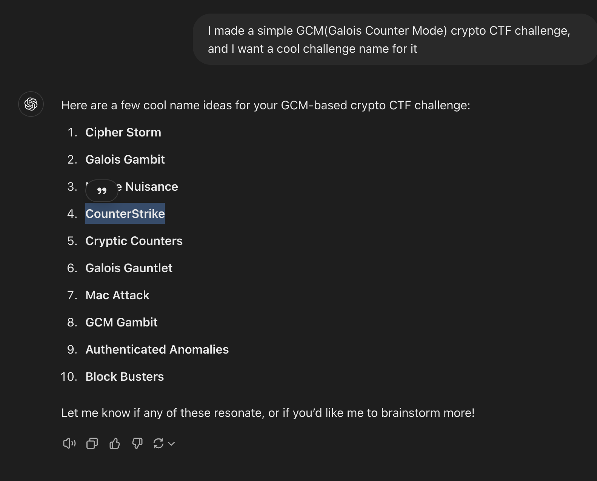
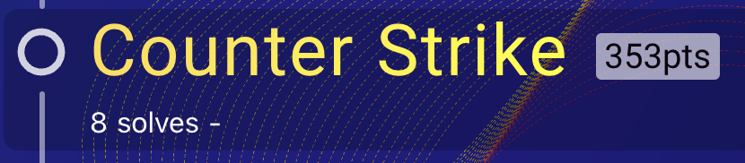
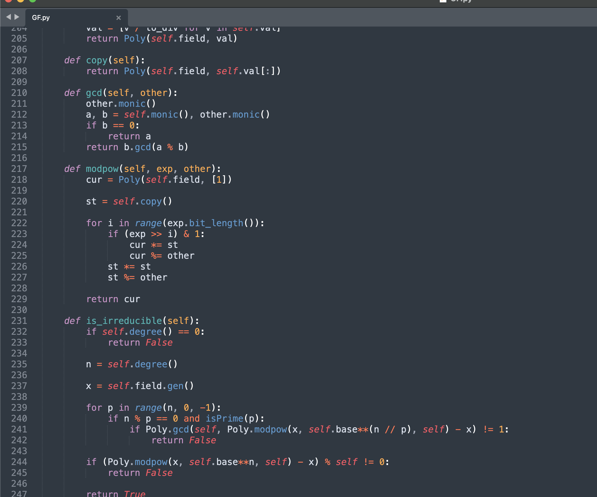
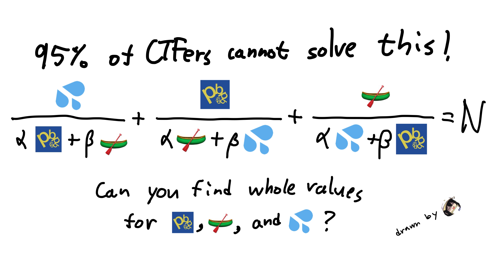
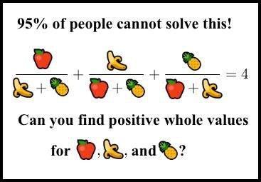
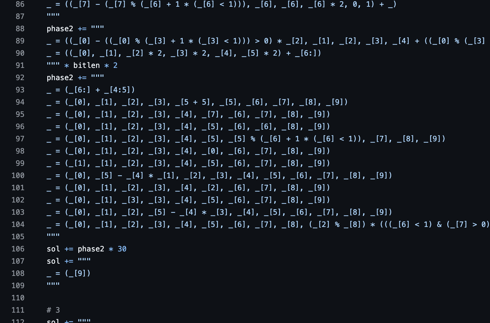
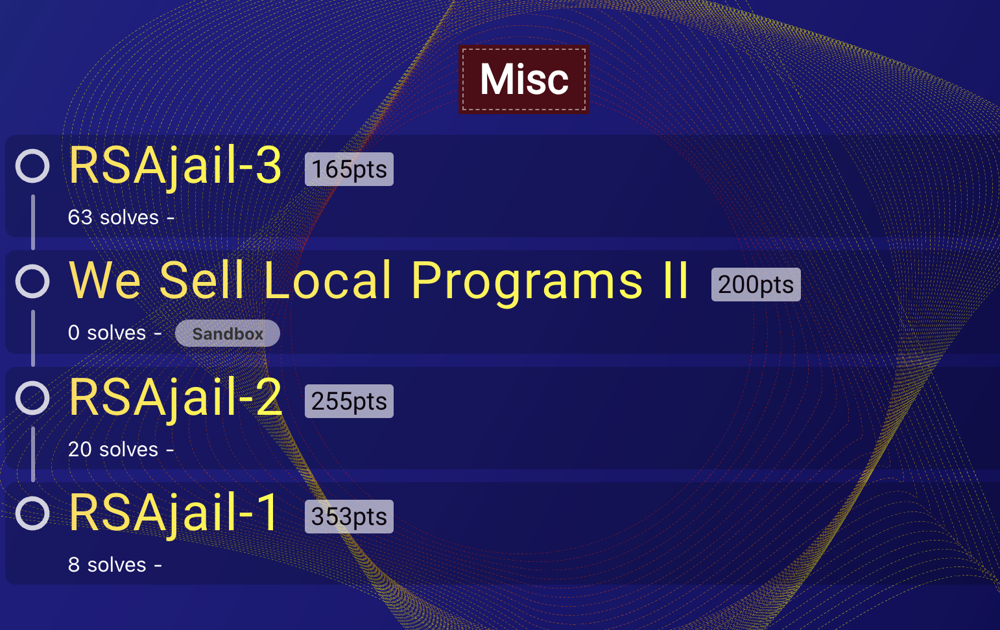
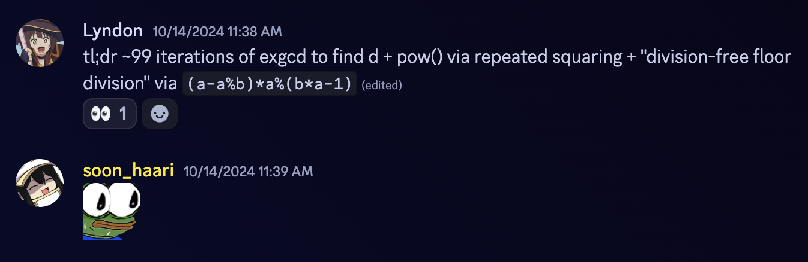

I authored some challenges to the first instance of [Blue Water CTF](https://bw.ctf.ing/), mostly nerdy math challs, but not all of them entirely crypto.



Very happy to get my name there! (I am [@ah_p_uh](https://x.com/ah_p_uh), come follow me)

All my challs are uploaded on my [GitHub](https://github.com/soon-haari/my-ctf-challenges) and you should be able to find brief solutions in English and solve codes, so I'll pass them this time. The reason is totally not because I am too lazy for it :))

Instead, I will share my journey for bwctf this time, including what I went through and memorable things.

An anonymous saint (\*\*\*beo) once said the following phrase, and I was deeply touched by it.


~~[@genni](https://genni21.github.io/), when are you going to post about how to spin up 100 cores for Coppersmith?~~

<br>

### 1. Are you even a member of Blue Water?

No :(

However at the end of June, **RBTree** asked me if I wanted to author a challenge for pbctf(Before the name changed to bwctf). If I remember correctly, I was on a family trip at that time, so it was totally unexpected and made my day. Thanks to perfect blue and Water Paddler, and special thanks to RBTree for the opportunity!

I remember last year's pbctf when I played solo with `soon_haari solo play with beer`, see [2023 pbctf](https://soon.haari.me/2023-pbctf/). **rkm0959** authored one challenge back then, and I thought, **"Oh I want to guest author pbctf too one day lol"**.

I immediately chose what challenge to reveal in pbctf. I had multiple challenges in my secret folder and chose the hardest and proudest one. That challenge was [Collider](https://github.com/soon-haari/my-ctf-challenges/tree/main/2024-bwctf/crypto/collider).



<br>

### 2. So what did you do during the gap, only author collider?

Not at all, RBTree, joseph, and I tried to cook up some more awesome crypto challenges! RBTree suggested multiple ideas including {redacted} and {redacted}, but we couldn't make all of them into a cool CTF challenge. Gladly, he eventually cooked up super interesting challenges: **MD5.01 & MD5.1** and **Fruit Math**.

Also, I finalized a GCM challenge thanks to RBTree's idea.

It translates to:
-  "The gcm challenge title is **Greatest Common Multiple**"

<br>

### 3. Wait wait, Greatest Common Multiple? That's your weird chall from codegate finals!

Yeah, the thing is, I already planned a challenge for codegate, and was going to call it **Greatest Common Multiple II** because codegate was happening after pbctf. But pbctf got delayed, and codegate came first, so I had to make the codegate chall [Greatest Common Multiple](https://soon.haari.me/gcm/).

I asked ChatGPT to make a new name for the bwctf GCM challenge. And that is how **Counter Strike** was born.



I still think Counter Strike is a great challenge, kinda different from casual GCM challs. Although codegate one is my masterpiece.

<br>

### 4. How hard was collider? You said it's the hardest one you've ever made.

I expected 0~1 solves within the CTF time which is 36 hours, and (fortunately?) ended with 0 solve. We made a first-blood bounty and didn't reveal the solution even after the CTF ended, and **@user202729** blooded it after around 2 days, congratulations!

His solution has some similarities with mine, but different parts too. It should be worth reading both the solutions, please join the [bwctf discord](https://discord.com/invite/5tkunAzz) and check #crypto for detailed discussions!

Oh also, the previous code was implemented with my handmade `GF.py` for field elements and polynomials which was 5kb.


I later found a thing called sympy and changed to that, so the source code was much shorter =)

<br>

### 4. I also saw you drawing a cool art for Fruit Math!





Cool drawing isn't it?

Also, I'm proud to say I contributed to finding an additional idea to make the root calculation much quicker!

<br>

### 5. And what about RSAjail challs?

This, I give the credit to [D1N0](https://x.com/am_i_dino) who authored a similar pyjail challenge for internal CyKor CTF.

It was a challenge to get a shell with repeated max 4 characters where `exec, eval` is blocked, and the intended solution was using `vars`.

D1N0's solution uses `_` since it stores the latest evaluated data.
```python
Python 3.11.1 (v3.11.1:a7a450f84a, Dec  6 2022, 15:24:06) [Clang 13.0.0 (clang-1300.0.29.30)] on darwin
Type "help", "copyright", "credits" or "license" for more information.
>>> ("soon_haari", "babo")
('soon_haari', 'babo')
>>> _
('soon_haari', 'babo')
```

And should be something like this:
```
vars
_()
...
```

However, my unintended solution was using that it allow multiple lines when a bracket is open.
```
(
vars
())
...
```

I found the concept very interesting and created a challenge that requires both of the interesting properties for Python interpreter.

<figure>

<figcaption>Can we still call that a python?</figcaption>
</figure>

I thought the solution to RSAjail-1 was clever and hard and thought not many people would solve this, but 8 teams solved the final version of the RSAjail series. People are just too good at jails with a hacker mindset :/



<br>

Lyndon came up with a really clever idea to do a big integer division with a 1-byte limit, making his(her) solution super shorter than others! :brain:



<br>

Also, my bro [Teddy](https://x.com/teddyctf) wrote a cool write-up for all 3 RSAjail series step-by-step, thanks to teddy as well!
- [RSAjail Writeups - Blue Water CTF 2024](https://thesavageteddy.github.io/posts/rsajail-bwctf-2024/)

<br>

### 6. Aaaaaaand now here we are, back in the present, the CTF is over!

Hope everyone who played bwctf had a great time, it always feels great watching people attempting or eventually solving my challenges.

Lastly, it was a great time organizing bwctf, with super talented people, as everyone knows pb and wp include some of the best hackers around the world. And thanks **Sampriti** for handling everything related to infra.. :pray:


This post is rather written freely than written in a write-up format, but I wanted to share my journey with you. Thanks for reading everyone!

- Btw dear crypto addicts, RBTree's MD5.1 is still not blooded and has a 100 bounty, please try it!!


