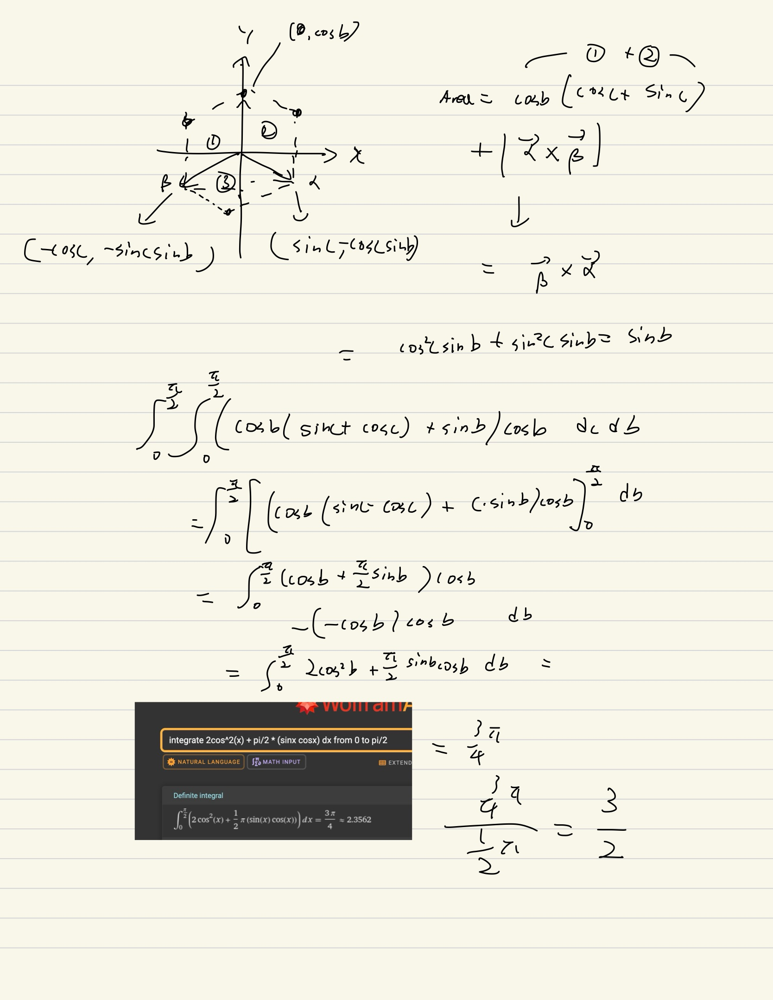

Like the post [Integral of 1÷(x⁵+1)](https://soon.haari.me/integral-of-1-x5-1), I was clickbaited on instagram with the following reel:

The question is quite simple again, what is the average area of a cube's shadow when it is placed *randomly*?

I tried solving it with classic integrations, and happy to get it right, and learned *randomly* is actually kinda tricky to define :)

Also Alice's solution in [A tale of two problem solvers (Average cube shadows)](https://youtu.be/ltLUadnCyi0) is super awesome, maybe you should rest coding or debugging for a while, and watch the video :wink:

Here's my solution hehe.

