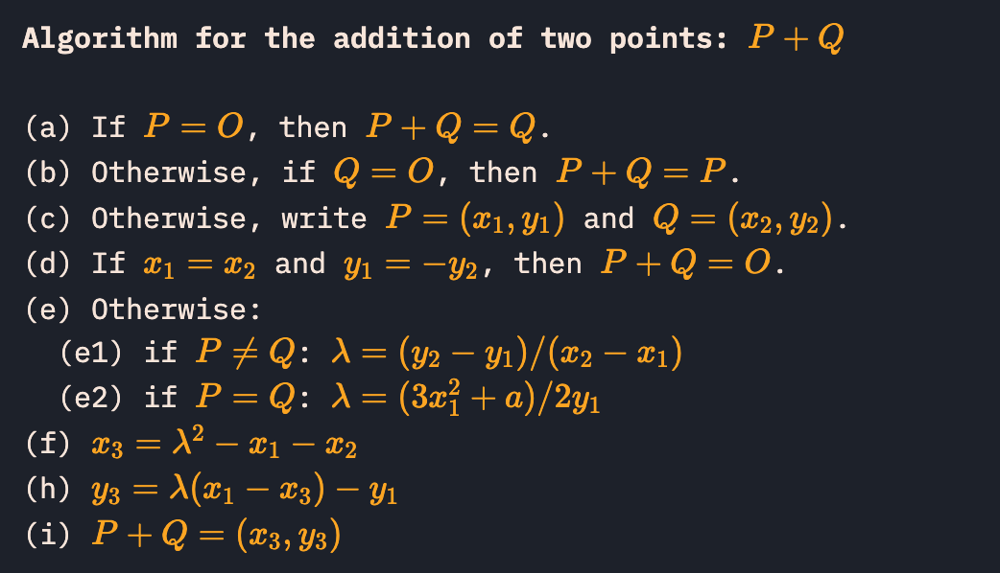

I originally planned to play KalmarCTF 2025 with **bingus**, however, the idek-ers and the Italians in bingus eventually decided to play as **idek** and **Tower of Hanoi**. Genni invited me to Tower of Hanoi as a guest player, and we took the 3rd place.


It was a delightful time with people in Tower of Hanoi, and special thanks to Genni, Escrimamenchi, Chino for inviting me.


<center>
<video src="../files/kalmar2025/yummy.mp4" muted autoplay playsinline width="300"></video>
</center>

I will review 3 hard crypto challenges including the one I couldn't solve during the CTF, which are a very good combo because those 3 challenges are very different styles yet super cool challenges.

<br><br>


Oh right, how could I miss this, enormous congrats to my bro Genni for this:


<br><br>

## Crypto - short circuit (4 solves)

> I dropped my crypto wallet in the toilet, so I asked crypto gang for help recovering my seed phrase... but they just started yelling about how "crypto means cryptography" and spammed [https://www.cryptoisnotcryptocurrency.com/](https://www.cryptoisnotcryptocurrency.com/) at me :(((

This was a challenge about `node.js`' `Math.random()` exploitation, and the source was extremely simple.

**chal.js**
```js
setTimeout(() => {
    console.log("Too slow!");
    process.exit();
}, 15000);

function generatePhrase(words) {
    const phrase = [];
    const redacted = [];
    for (let i = 0; i < 12; i++) {
        const word = words[Math.floor(Math.random()*words.length)];
        phrase.push(word);
        if (i < 5)
            redacted.push(word[0] + "****");
        else
            redacted.push("*****");
    }
    return [phrase.join(" "), redacted.join(" ")];
}

const fs = require("fs");
const readline = require("readline");
const wordlist = fs.readFileSync("words.txt", "utf8").trim().split("\n");

for (let i = 0; i < 13371337; i++)
    Math.random();

const [phrase, redactedPhrase] = generatePhrase(wordlist);

console.log("Welcome to the #crypto-gang admin panel!")
console.log();
console.log("Please enter the seed phrase for your crypto-wallet to log in.")
console.log(`(hint: ${redactedPhrase})`);

const rl = readline.createInterface({ input: process.stdin, output: process.stdout, terminal: false });
rl.question("> ", (answer) => {
    if (answer === phrase)
        console.log(fs.readFileSync("flag.txt", "utf8"));
    else
        console.log("Nope!"); 
    process.exit();
});
```

```
Welcome to the #crypto-gang admin panel!

Please enter the seed phrase for your crypto-wallet to log in.
(hint: s**** s**** c**** m**** a**** ***** ***** ***** ***** ***** ***** *****)
```

The output only gives the first 5 words' first character as a hint, and we have to recover the random state from only that information. It is known that `node.js` uses xorshift128+, and is harder to break compared to completely linear PRNGs.

Also, the information we can retrieve from the hint is way too small compared to xorshift128+'s state. Assuming we were very lucky so that we got all `"z"` for the 5 letters(Only 4 words start with z in 2048), it still gives only `2048 / 4 = 512, 9 bits` of information, in total 45 bits.

I haven't dig this so much, but I saw something about the seeding getting one 64-bit state from urandom, and another from time-based value. Even considering that, still it requires `64 - 45 = 19` bit brute-force, which sounds infeasible(Not to mention we will get way less than 9 bits of hint per letter normally).

> Also there's this weird `for (let i = 0; i < 13371337; i++) Math.random();` before the start.<br>
> Genni said using the fact one of the states was time-based would be extremely hard because of these iterations.<br>
> That assumption was totally fair if it was normal xorshift128+, who would have known the 13371337 was actually the part that would help us..

So I concluded that something must be horribly wrong with the according version of `node.js` which is `node:10-alpine` which is incredibly old in 2025. And hey, Ske is a web player!! 🧠

<br>

After a painful time of osinting(I was not extremely used to this kind of searching), there was this chromium bug post: [Math.random() returns biased results due to states being flushed to NAN, and after ~10s a totally fixed sequence](https://issues.chromium.org/issues/42211416).

In short, according `node.js` version's xorshift128+ stores the state as *double* instead of *uint64* :megajoy:, most likely because it would be easier to calculate `Math.random()` which is a *double* type.

Unfortunately, there exist these weird types of double values: NaN, +inf, -inf.

- Because the array is an array of boxed doubles, each double is checked for being nan before being set into the array. If it *is* any kind of nan, it's set to the canonical nan representation before being stored

Wait is there more than 1 NaN? Well yes, turns out there are incredibly many NaNs.

```
Sign bit  | Exponent (11 bits) | Fraction/Mantissa (52 bits)
------------------------------------------------------------
   1 bit  |       11 bits      |         52 bits
```


In conclusion, sounds like setting the first 12 or 13 bits would directly lead the entire value to be NaN, ignoring the rest of the Mantissa part, and $\frac{1}{2^{12}}$ is a very large probability.

The bug also included this nice example of why this is a mathematical problem:
```js
    while(Math.random() != 0.15567932943235995857)
    {

    }
   
    var arr = [];
   
    ///always the same
    for(var i=0; i < 10; i++)
    {
        arr.push(Math.random());
    }
   
    return arr
```

The reason for this is there is definitely a moment after some iterations when both states become NaN, which will always have the same state, and thus will have equal next outputs. The probability of this should be around $\frac{1}{2^{24}}$ which is still not a negligible probability. But it still may require around $2^{24}$ iterations for that to likely happen, where `for (let i = 0; i < 13371337; i++) Math.random();` is very helpful now.

In conclusion, we just have to pray that consecutive NaN has already happened in the server, within those 13371337 iterations. And we create a dictionary table for all pairs of 5 characters locally.


A worthy conversation between the author:


Anyway as we can see in the picture, I failed to make a dictionary table in the docker, but found an even less painful way to solve it.

<br>

I created a new docker with another javascript file, which brutes the loop without storing anything so that it won't run into memory problems.

```js
function generatePhrase(words) {
    ...
}

const fs = require("fs");
const readline = require("readline");
const words = fs.readFileSync("words.txt", "utf8").trim().split("\r\n");

while(Math.random() != 0.15567932943235995857) {}
let cnt = 0;

const a = [];

for (let i = 0; i < 12; i++) {
    const word = words[Math.floor(Math.random()*words.length)];
    a.push(word);
}


const rl = readline.createInterface({
    input: process.stdin,
    output: process.stdout
});

let result; // Define global variable

function getFirstCharacters(input) {
    return input
        .split(" ")
        .slice(0, 5)
        .map(word => word[0])
        .join("");
}

function askQuestion(query) {
    return new Promise(resolve => {
        rl.question(query, answer => {
            resolve(answer);
            rl.close();
        });
    });
}

async function main() {
    let userInput = await askQuestion("Enter your text: ");
    result = getFirstCharacters(userInput); // Store result in global variable
    console.log("Processed Output:", result);
}

// Call the function
main().then(() => {
    while (1){
        a.shift()
        const word = words[Math.floor(Math.random()*words.length)];
        a.push(word);
        let suc = true;
        for(let i = 0; i < 5; i++){
            
            if(result[i] != a[i][0]){
                suc = false
                break;
            }
        }

        if(suc){
            console.log(a.join(" "));
            process.exit(1);
        }
    }
});
```
(Yes as you see those robotic comments, I am not *that* familiar with js, ChatGPT helped me)

Then the following brute-force code solves the challenge!

```python
from pwn import *
cnt = 0
while True:
    cnt += 1
    print(cnt)
    io1 = remote("short-circuit.chal-kalmarc.tf", 1337)
    io2 = remote("localhost", 1337)

    io1.recvuntil(b"(hint: ")
    hint = io1.recvline().decode().split(")")[0]
    io2.sendline(hint.encode())
    io2.recvline()
    res = io2.recvline()[:-1]
    io2.close()
    io1.sendline(res)
    res = io1.recvline()
    io1.close()

    if b"Nope" not in res:
        print(res)
        exit()
```

<br><br>

## Crypto - ZZKAoK (6 solves)

> NEW PROOF SYSTEM, WHO DIS?

Oh yippie, a ZK challenge, it is never not fun!

The challenge was to prove factors of a given $n$ by providing the following parameters:
- $p * q = n$
- $a_1^2 + a_2^2 + a_3^2 + a_4^2 = p^2 - 4$
- $b_1^2 + b_2^2 + b_3^2 + b_4^2 = q^2 - 4$

Which should be a valid constraint since $p, q$ cannot be $\pm1$.

Obviously, users don't know the factors of $n$, so there must be a bypass.

I read the code for a while, and understood 100% of the code, and what it was supposed to do. ~~Except it looked safe~~ However Genni found the bug in minutes, which was not even the intended bug, and I quickly wrote the solver to exploit the bug.

Post-CTF, I heard about the intended bug as well, so wrote a solver exploiting the intended bug as well, and shared both solutions.

I will explain both, but assuming the reader already understood how [intarg.py](https://github.com/soon-haari/soon-haari.github.io/blob/master/files/kalmar2025/intarg.py) works :)

<br>

### Unintended bug - Vulnerable verify function

```python
def verify(root: str, proof: list, pos: int, size: int) -> bytes:
    assert len(proof) > 0
    assert len(proof) < 32

    lvls = len(proof) - 1
    assert 1 << lvls == size

    leaf = proof[0]
    node = sha256(leaf)

    for i in range(1, lvls+1):
        (dirc, sibl) = proof[i]
        assert isinstance(sibl, str)
        assert isinstance(dirc, int)
        assert len(sibl) == 64
        assert dirc in [0, 1]
        if dirc == 0:
            node = sha256(node + sibl)
        else:
            node = sha256(sibl + node)

    assert node == root
    return leaf
```

We can spot that this function receives `pos` as a parameter, but is never used. Can we use this bug for an exploit?

Surely! We can save $2^{18}$ different values in the Merkle, and after Fiat-Shamir is finished and modulus primes are selected, we can choose our needed result modulo that prime, in the pool of $2^{18}$. 

Some of the primes have a size larger than $2^{18}$ since the last prime is 3681131 which is like 14 times larger than $2^{18}$. So in some cases, we have to brute force for small roots that are in `range(2**18)`. Let's do it step by step.

<br>

For a prime number $pr$ where $pr$ is one of the `QUERIES` numbers of selected primes, we have to find some root pairs on $\mathbb{F}_{pr}$ that satisfies: 
- $p * q = n$
- $a_1^2 + a_2^2 + a_3^2 + a_4^2 = p^2 - 4$
- $b_1^2 + b_2^2 + b_3^2 + b_4^2 = q^2 - 4$
- $c_1p + c_2q + \cdots + c_{10}b_4 = v$

$v$ has to be less than a 50000-bit length value, so I just set it to 0.

My solution was the following:
1. Choose random values of $p$, and calculate the corresponding $q$.
2. Using `four_squares` function, calculate $b_1 \cdots b_4$.
3. Choose random values of $a_3, a_4$
4. Finally we have the following two equations:
    - $a_1^2 + a_2^2 = \text{value1}$
    - $a_1c_3 + a_2c_4 = \text{value2}$
    - By writing $a_2 = \frac{\text{value2} - a_1c_3}{c_4}$, we can find $a_1$ by finding root of a 2 degree polynomial.
5. Repeat until the root exists. (Sometimes the polynomial is irreducible.)

As I mentioned before, there are some cases where the primes are greater than $2^{18}$, so I bruted for the small roots below $2^{18}$.

Check out [ex_pos.sage](https://github.com/soon-haari/soon-haari.github.io/blob/master/files/kalmar2025/ex_pos.sage).

<br>

### Intended bug - Unused commitments

Since the modulus in total, is `prod(PRIMES)`, it could be thought that if we solve the required constraints on modulus `prod(PRIMES)`, it will pass the check for whatever `QUERIES` primes are chosen. This approach actually passes all the checks except the following:

```python
    def value(self):
 value = next(self.vals)
        assert - 2**BITS < value < 2**BITS
 ...
```

If we found some solutions on modulo `prod(PRIMES)`, the solution would be gigantic. And the `value` stores the linear sum of 10 `tx.challenge()` and $p, q, a_1, a_2, a_3, a_4, b_1, b_2, b_3, b_4$ and it cannot be within bitsize of 50000.

Or is it?

```python
    def combine(self):
        expr = Mul(self.tx.challenge(), self.coms[0])
        for com in self.coms[1:]:
            expr = Add(expr, Mul(self.tx.challenge(), com))
        return expr
```

We can see that function `combine` combines *all* of the commitments, not the only used 10 ones. So user can add the 11th commitment which is not even used, but just to make linear sum a small value such as 0.

> Fun fact - I spotted this, but passed it through during the CTF :sob: <br> 

The solution from now on is pretty simple, find the roots in every $2^{18}$ prime modulus, and find the corresponding 11th commitment value. Note that the 11th commitment is not even included in the transcript(just only the function `verify` is called for it). So you can first choose the `QUERIES` primes, then build the commitment, by only finding leaves on selected primes, and set all the other leaves to zero.

I'm mentioning this because you might have some issues if you try to find the 11th commitment on all $2^{18}$ moduli. After all, some of the moduli are pretty small, like 2, 3, 5 ...

Oh also, some people on the channel mentioned CRT with $2^{18}$ moduli takes a long time, but you don't need to compute CRT even once :)

Check out [ex_com.sage](https://github.com/soon-haari/soon-haari.github.io/blob/master/files/kalmar2025/ex_com.sage).

<br><br>

## (Upsolved) Crypto - lance-hard? (2 solves)

> A day with the Aarhus Crypto Group.<br><br>Note: our solution takes 35 core-hours. We're curious how much faster you can solve it.

This is the challenge I spent most of the time on. I failed to solve it during the CTF, but understanding other people's solutions, I really learned a lot.

<br>

**chall.sage**
```python
#!/usr/bin/env sage

from Crypto.PublicKey import ECC
from Crypto.Random import random as cryrand
from Crypto.Util.strxor import strxor
from hashlib import shake_128

samples = 1000

curve_bits = 80

p = (2^curve_bits).next_prime()
F = GF(p)
while True:
    a = F(cryrand.randrange(int(p)))
    b = F(cryrand.randrange(int(p)))
    E = EllipticCurve(F, [a,b])
    order = E.cardinality()
    if order.is_prime():
        break
print(p, a, b)

K = E.gens()[0] * cryrand.randrange(int(order))
r = cryrand.randrange(int(p))

for i in range(samples):
    a = cryrand.randrange(int(order))
    out = (a * K).x() + r
    print(a, out)

with open('flag.txt', 'r') as flag:
    flag = flag.read().strip().encode()
    keystream = shake_128(str((K.x(), r)).encode()).digest(len(flag))
    ctxt = strxor(keystream, flag)
    print(ctxt.hex())
```

`K` is a random point on an elliptic curve, and `r` is a random element on $\mathbb{F}_p$. We are given 1000 pairs of `((K * a).x() + r) % p` where `a` is a known random value. The goal is to recover `r`.

The first thing I thought was this. `P1 = a1 * K, P2 = a2 * K`, which means `P2 = (a2 / a1) * P1`. Can I do anything with this?

Then it became this. What if I use LLL to decompose `(a2 / a1)` and make `P2 * c = P1 * d` where `c, d` is 40 bits? Or maybe `P2 * c + P1 * d = O`?

Yeah, I think we all know where this is going.

<br>

So we have to find a pair, such that $a_0c_0 + a_1c_1 + \cdots + a_{n - 1}c_{n - 1} = 0 \mod o$, where $c_i$ is small. What can we do with these pairs?

<br>

### 1. Yeah what can we do with these pairs?

We can write every point's x-coordinate as a polynomial of $r$, to be accurate, 1-degree polynomials. If we know point A and B's x-coordinate as a polynomial of $r$, can we rewrite (A + B)'s x-coordinate as a polynomial of $r$?



Revisiting CryptoHack's point addition algorithm, the conclusion is we can!

But some problems exist:
- Division sounds kinda stressful
- Sqrt sounds even more stressful

Let's rewrite the addition with symbols then.

<center>$y_1^2 = x_1^3 + ax_1 + b, y_2^2 = x_2^3 + ax_2 + b$</center>
<center>$x_3= \left(\frac{y_1 - y_2}{x_1 - x_2}\right)^2 - x_1 - x_2$</center>

We can recursively add multiple points and represent the x-coordinate with multiple $x_i$ and $y_i$. After the addition is finished, we finally remove all of the $y_i$ by squaring.

My method of doing that was the following. Removing all $y_i^2$ and replace it to $x_i^3 + ax_i + b$, then the entire polynomial's degree of $y_i$ should be 1. Put all the terms with $y_i$ to the LHS, and the others to the RHS. Squaring both side will successfully remove $y_i$.

<br>

Oooh yeah, that does sound painful to implement.

But I managed to implement it with SageMath's univariate polynomial on $r$, by making a dictionary that stores coefficients of every $y_i$, $y_iy_j$ ... and such. This is doable because we can always remove $y_i^2$, so assume we have $l$ points, then $2^l$ key-value pairs in max is sufficient. I implemented multiplication to remove $y_i^2$ everytime so that the polynomial doesn't get too gigantic.

Also, I made a new class that stores the denominator and the numerator each.

<br>

Here's my code that adds `l` points, and finds possible `r` from the final polynomial.

```python
p, A, B = 1208925819614629174706189, 73922274628233716557252, 512377843723837814597638
Fp = GF(p)

E = EllipticCurve(Fp, [A, B])
o = 1208925819612918806332907

l = 10

pts = []
for i in range(l - 1):
    pts.append(E.random_point())
pts.append(-sum(pts))
assert sum(pts) == 0
assert len(pts) == l

r = Fp.random_element()

out = [pt.xy()[0] + r for pt in pts]
real = r

P.<r> = PolynomialRing(Fp)

def myadd(a, b):
    c = deepcopy(a)

    for bb in b:
        if bb not in c:
            c[bb] = 0
        c[bb] += b[bb]
        if c[bb] == 0:
            c.pop(bb)
    return c

def mysub(a, b):
    return myadd(a, myneg(b))

def myneg(a):
    return {aa: -a[aa] for aa in a.keys()}

def mymul(a, b):
    a = deepcopy(a)
    b = deepcopy(b)
    res = {}

    for aa in a:
        av = a[aa]
        for bb in b:
            bv = b[bb]

            val = av * bv

            newtup = []

            tomul = []

            for i in range(l):
                if i in aa and i in bb:
                    tomul.append(i)
                elif (i in aa) or (i in bb):
                    newtup.append(i)
            newtup = tuple(newtup)

            for i in tomul:
                v = xs_origin[i]
                val *= v^3 + A * v + B


            if newtup not in res:
                res[newtup] = 0
            res[newtup] += val


    return res

class mypoly:
    def __init__(self, num, denom):
        self.num = deepcopy(num)
        self.denom = deepcopy(denom)

    def __neg__(self):
        return mypoly(myneg(self.num), self.denom)

    def __sub__(self, other):
        return self + (-other)

    def __add__(self, other):
        if self.denom == other.denom:
            return mypoly(myadd(self.num, other.num), self.denom)
        else:
            a, b = self.num, self.denom
            c, d = other.num, other.denom

            return mypoly(myadd(mymul(a, d), mymul(b, c)), mymul(b, d))

    def __truediv__(self, other):
        a, b = self.num, self.denom
        c, d = other.num, other.denom

        return mypoly(mymul(a, d), mymul(b, c))

    def __mul__(self, other):
        a, b = self.num, self.denom
        c, d = other.num, other.denom

        return mypoly(mymul(a, c), mymul(b, d))

    def numerator(self):
        return self.num

import time
start = time.time()

def poly_to_dict(a):
    return mypoly({(): a}, {(): 1})

xs_origin = [out[i] - r for i in range(l)]
xs = [poly_to_dict(xs_origin[i]) for i in range(l)]
ys = [mypoly({tuple([i]): 1}, {(): 1}) for i in range(l)]

xxs = []

for IDX in range(2):
    IDX = IDX * l // 2

    curx = xs[IDX]
    cury = ys[IDX]

    st, en = IDX + 1, IDX + l // 2 + (l % 2) * bool(IDX)

    for i in range(st, en):
        x1, y1 = curx, cury
        x2, y2 = xs[i], ys[i]

        lam = (y2 - y1) / (x2 - x1)

        curx = lam * lam - x1 - x2

        if i != en - 1:
            cury = lam * (x1 - curx) - y1


    xxs.append(curx)

zero = (xxs[0] - xxs[1]).numerator()


for i in range(l):
    aa = {}
    bb = {}
    for a in zero.keys():
        if i in a:
            aa[a] = zero[a]
        else:
            bb[a] = zero[a]

    zero = mysub(mymul(aa, aa), mymul(bb, bb))

zero = zero[()]

print(zero.degree())

roots = [rr[0] for rr in gcd(pow(r, p, zero) - r, zero).roots()]

print(roots)
print(real)

assert real in roots

end = time.time()

print(f"Took {end - start:.2f}s for {l = }")
```

- `l = 8` takes 1.85 seconds.
- `l = 10` takes 71.86 seconds.
- `l = 12` takes 5453.21 seconds.

This is incredibly slower than what Neobeo and Sceleri are cooking now, but their solution was done with 12 points as well, and 5453.21 seconds is definitely within a doable limit, so I will mark this as success. (No I don't take any counterarguments. T_T)

> Neobeo's idea using multiple 3-pairs and resultant is incredible, using Lagrange as well. Make sure to read his writeup as well when it's finished. BUT I WILL STILL MARK THIS AS SUCCESS.

<br>

### 2. How to find those pairs?

The best result Genni made with LLL was 20 points, and saw Neobeo and Blupper making 17, which sounds a still little bit hard.

The curve order is around $2^{80}$, so I decided to perform a Birthday problem, with $O(2^{40})$.

<br>

Which didn't turn out so well. Mostly because $2^{40}$ in memory is not generally doable. 

I used 192G RAM, 40-core server, and C++ with O3, yet still resulted in 1260 hours of ETA(50000 core-hour). I was so sad at the fact I actually could have solved this challenge if `curve_bits` was 70 instead of 80, but hey I learned many things so it's okay :)

<br>

Turns out there's this really cool thing called **Wagner's generalized birthday problem**. It's mathematically really easy to understand, yet so clever that I couldn't think of, and even tried. I won't explain this too much, since other dudes are cooking their write-up.

> Oh just one comment to Neobeo: <br><br><br>I don't think you had to give up solving even if it didn't have any solutions, I think there are various things to try more :) Such as...<br> - Splitting 1000 to randomly selected 500 and others instead of the first half<br> - Including some of the $2a_i, -2a_i$ in the pool, or even 3.

<br><br><br>

I had a good memory of KalmarCTF2024 and had high hopes for this year as well. It didn't let my hopes down. ❤️


