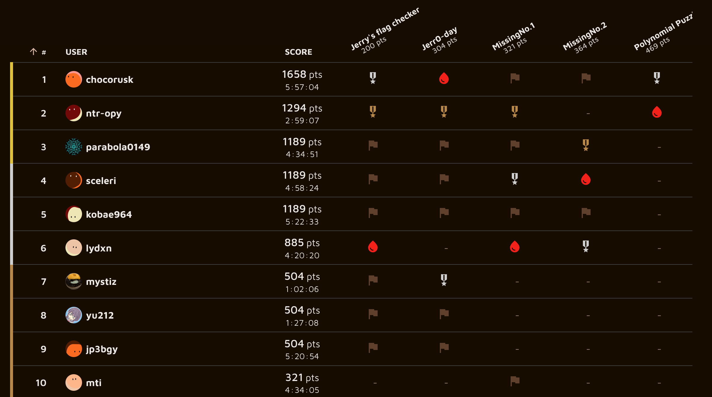
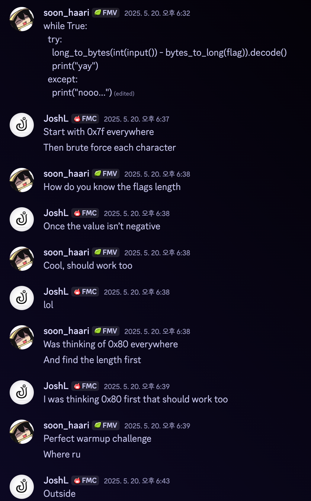
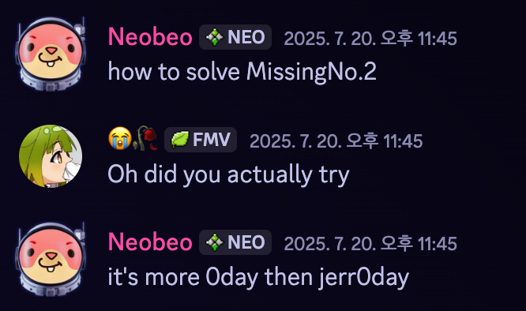
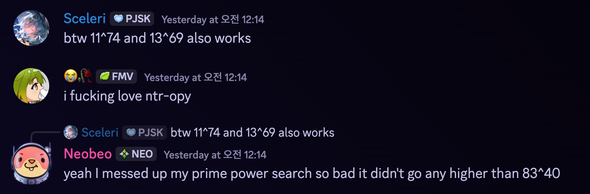
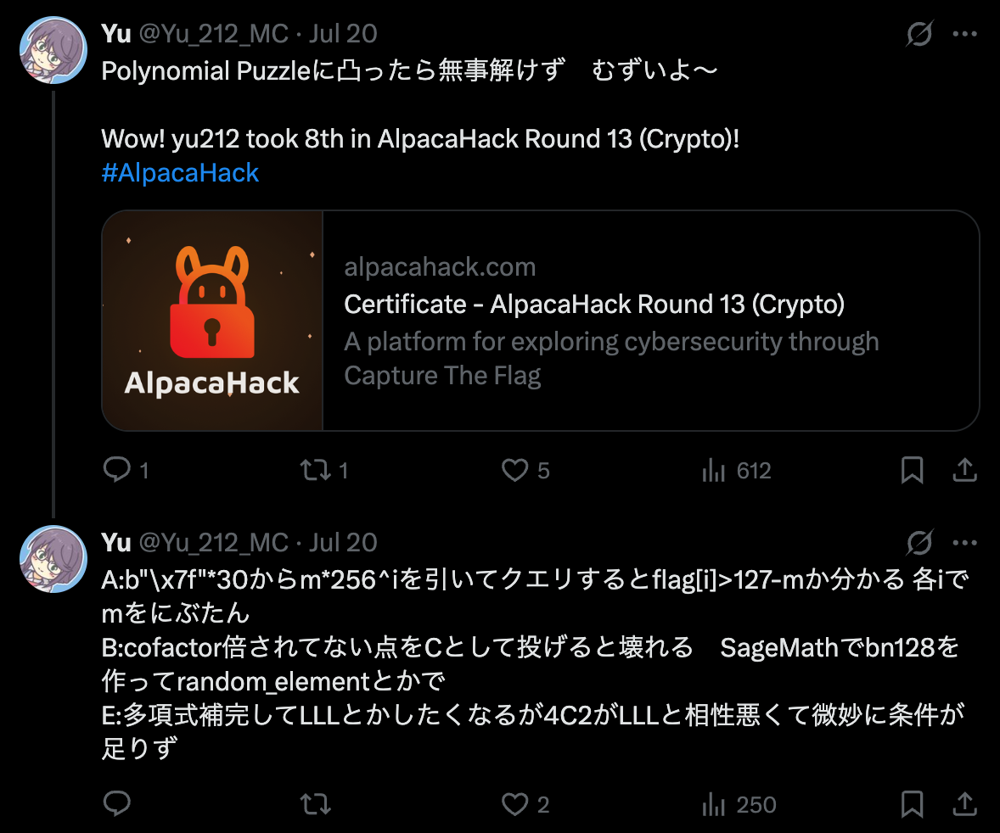
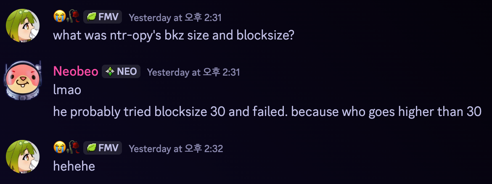

I authored all 5 challenges for [Alpacahack Round 13](https://alpacahack.com/ctfs/round-13) which was held this Sunday. Thanks for all people who played it, and I wish they had fun. Congrats to chocorusk for winning this round!



This post will include a *very brief* explanation of the solutions, and some additional fun related to them. You can find all solve code in [my-ctf-challenges](https://github.com/soon-haari/my-ctf-challenges/blob/main/Alpacahack-round-13). Note that distfiles may be slightly different between whats in the repo, and the real challenge, there was some additional edit and trimming by keymoon.

<br><br>

## Jerry's flag checker (21 solves)

> Jerry will verify your flag for you!

```python
from Crypto.Util.number import *
import os

flag = bytes_to_long(os.environ.get("FLAG", "fakeflag").encode())

while True:
    try:
        if long_to_bytes(int(input("Guess the flag in integer: ")) - flag).decode():
            print("Wrong flag. :P")
        else:
            print("Yay, you found the flag! :3")
    except:
        print("Weird... :/") 
```

It can be seen the `.decode()` and the `try-except` are meant to be some kind of oracle, and give user some information for a solve. The only key part for this simple challenge, is to find one initial input that satisfies the condition, then it can be easily found by bruting byte-by-byte.

Assuming all flag bytes are ascii, they must be in range of `[32, 127)`. Thus, first guess the number of flag length, then sending `bytes_to_long(b"\x7f\x7f\x7f\x7f...")` can make it print `"Wrong flag. :P"` instead of `"Weird... :/"`. Note that this method even allows you not to guess the flag's length, since you can just put long string like 100 bytes and it'll still succeed to decode.

`Alpaca{ASCII_oracle_attack!!}`

<br>

I remember asking my friend JoshL, one of the sexiest reversers, for a testsolve cuz we were on a long trip together then(Of course I told him he can't participate). Josh suggested the solution above, which is even cleaner than my intended using `"\x80"` in my opinion.



<br>

Something like the following can be done too, since it gives the same oracle, but requires multiple connections. This make it less obvious for a solution, but it's a warmup challenge anyways, and also preventing excessive connections, I chose to use while loop.

```python
from Crypto.Util.number import *
import os

flag = bytes_to_long(os.environ.get("FLAG", "fakeflag").encode())

if long_to_bytes(int(input("Guess the flag in integer: ")) - flag).decode():
    print("Wrong flag. :P")
else:
    print("Yay, you found the flag! :3")
```

<br><br>

## Jerr0-day (8 solves)

> Jerry thinks he discovered a 0-day!

```python

from py_ecc import bn128
from ast import literal_eval

def recv_G1():
    return tuple(bn128.FQ(val) for val in literal_eval(input("Input G1: ")))

def recv_G2():
    return tuple(bn128.FQ2(val) for val in literal_eval(input("Input G2: ")))

A, B = recv_G1(), recv_G1()
C = recv_G2()

if (
    bn128.pairing(C, A) * bn128.pairing(C, B)
    ==
    bn128.pairing(C, bn128.add(A, B))
    ):
    print("Looks like it's safe!")
else:
    import os
    print(os.environ.get("FLAG", "fakeflag"))
```

This seems impossible in the first glance, if you know about pairings. I ~~wish~~ wonder if someone even tried to use the zero point or something cuz that point always causes issues, but shouldn't work.

If you're familiar with pairing friendly curves, they should know the curve for G2 affine is actually not the curve itself, it's always a subgroup of a curve. This means if there's only on-curve check and no subgroup check, invalid G2 points **that doesn't follow pairing's property** can be used in thie py-ecc package.

Turns out there's no subgroup check. [py_ecc](https://github.com/ethereum/py_ecc/blob/main/py_ecc/bn128/bn128_pairing.py#L108-L114):
```python
# Pairing computation
def pairing(Q: Point2D[FQ2], P: Point2D[FQ]) -> FQ12:
    if not is_on_curve(Q, b2):
        raise ValueError("Invalid input - point Q is not on the correct curve")
    if not is_on_curve(P, b):
        raise ValueError("Invalid input - point P is not on the correct curves")
    return miller_loop(twist(Q), cast_point_to_fq12(P))
```

[py_ecc](https://github.com/ethereum/py_ecc/blob/main/py_ecc/bn128/bn128_curve.py#L63-L68):
```python
# Check that a point is on the curve defined by y**2 == x**3 + b
def is_on_curve(pt: Point2D[Field], b: Field) -> bool:
    if is_inf(pt) or pt is None:
        return True
    x, y = pt
    return y**2 - x**3 == b
```


Simply sending random point in G2 curve messes up pairing result, and solved the challenge.
```python
from pwn import *

io = remote("localhost", 9997)

q = 21888242871839275222246405745257275088696311157297823662689037894645226208583
r = 21888242871839275222246405745257275088548364400416034343698204186575808495617

F = GF(q)
F2.<u> = GF(q^2, modulus=x^2 + 1)

E = EllipticCurve(F, [0, 3])
E2 = EllipticCurve(F2, [0, 3 / (u + 9)])

A, B = E.random_element(), E.random_element()
assert A * r == B * r == E(0)
C = E2.random_element()
assert C * r != E2(0)

io.sendlineafter(b"Input G1: ", str(A.xy()).encode())
io.sendlineafter(b"Input G1: ", str(B.xy()).encode())
io.sendlineafter(b"Input G2: ", str(tuple(tuple(val) for val in C.xy())).encode())


io.interactive()
```

`Alpaca{Not-a-0day-https://github.com/Consensys/gnark-crypto/blob/master/ecc/bn254/g2.go#L208-L226}`

<br>

Out of context, I love the name **Jerr0-day** cuz **0** is leetcoded **o**, so that it has substring **0-day** inside, and Jerroday is pronounced very similar to zeroday. And most importantly I am Jerry.

<br><br>

## MissingNo.1 (7 solves)

> I think the original challenge from Neobeo is too easy...
> This is a revenge challenge of [MissingNo.](https://github.com/AustICCQuals/Challenges2025/tree/main/crypto/missingno) from OICC 2025.

```python
FLAG = os.environ.get("FLAG", "Alpaca{********************************************}").encode()

F = GF(0xdead1337cec2a21ad8d01f0ddabce77f57568d649495236d18df76b5037444b1)
A = random_matrix(F, len(FLAG))[:,:-2]
b = A * random_vector(F, A.ncols()) + vector(F, FLAG) * F.random_element()
print(dumps((A, b)).hex())
```

The source code looks completely identical except for the `[:,:-2]`, which if you understand the original challenge's solution, is not really solvable with the same method. However, a server is given and you can gather multiple information by connecting more than once.

Efficiently, with two connections, it's possible to get the same amount of information from the original challenge, and solve via LLL/BKZ. But with even more, LLL is not even needed. Check out [solve.sage](https://github.com/soon-haari/my-ctf-challenges/blob/main/Alpacahack-round-13/missingno1/solution/solve.sage) with 2 connections, and [solve_9.sage](https://github.com/soon-haari/my-ctf-challenges/blob/main/Alpacahack-round-13/missingno1/solution/solve_9.sage) with 9 connections and no LLL. But I didn't block that solution, since this challenge is also supposed to be a level 2. But instead I complained in the flag.

`Alpaca{Sad_if_you_used_more_than_2_connections__>:(}`

<br>

I am aware that the real challenge code looked a bit more complex due to the fix, while I wanted the difference from the original challenge to be minimum as possible... hope it didn't make players try to spot bugs in another place, e.g. utils.py.

<br><br>

## MissingNo.2 (5 solves)

> This time the fix must have made it safe enough!
> This is a revenge challenge of [MissingNo.](https://github.com/AustICCQuals/Challenges2025/tree/main/crypto/missingno) from OICC 2025.

```python
FLAG = os.environ.get("FLAG", "Alpaca{********************************************}").encode()
pad = os.urandom(len(FLAG))
FLAG = [a ^^ b for a, b in zip(FLAG, pad)]

q = int(input("Missing order: "), 16)
assert not is_prime(q) and q.bit_length() == 256

F = GF(q)
A = random_matrix(F, len(FLAG))[:,:-2]
b = A * random_vector(F, A.ncols()) + vector(F, FLAG) * F.random_element()
print(dumps((A, b, pad)).hex())
```

Seems pretty much the same, but this time you can set the GF order to a 256 bit integer you like, and the flag is XORed with a known OTP every connection. The XOR blocks the solution for MissingNo.1.

If we call `A`'s two left_kernel vector `v1, v2`, then:
- `v1 * b = (v1 * FLAG) * F_random_element`
    - `(v1 * b) * (v2 * FLAG) = (v2 * FLAG) * (v1 * FLAG) * F_random_element`
- `v2 * b = (v2 * FLAG) * F_random_element`
    - `(v2 * b) * (v1 * FLAG) = (v1 * FLAG) * (v2 * FLAG) * F_random_element`

Thus:
- `(v1 * b) * (v2 * FLAG) - (v2 * b) * (v1 * FLAG) = 0`
- `((v1 * b) * v2 - (v2 * b) * v1) * FLAG = 0`

Ok, so we know a nullspace of FLAG which length is 52 (This is not any differenc from MissingNo. or MissingNo.1 but just re-explaining), and the FLAG is only consistent of 52 integer terms of the field, no terms multiplied to Field's generator. This means if the field's power is 52 or more, you can just solve the linear equations.

Let's see the order $37^{49}$ I used for my solution, since we know the flag format `Alpaca{}`, there are only 44 unknowns, and with 49 equations the system is solvable, however we can only know FLAG modulus 37. No problem, that's where multiple connections & XOR pads help. Gathering 2 ~ 4 informations by multiple connections will be enough for 44 unknown values to have a single possible candidate.

Check out [solve.sage](https://github.com/soon-haari/my-ctf-challenges/blob/main/Alpacahack-round-13/missingno2/solution/solve.sage).

`Alpaca{Oh_I_forgor_GF_allows_these_weird_values_:'(}`

<br>





<br><br>

## Polynomial Puzzle (2 solves)

> You know you have to kill Daki and Gyutaro at the same to beat them right?
> This is a revenge challenge of Polynomial Game from LakeCTF '24-'25 Finals.

```python
K = GF(random_prime(2 ^ 35))
R = K["x"]

d = 20
f = R.random_element(degree=d)

print("Welcome to the Polynomial Puzzle!")
print(f"f(x) is a univariate degree {d} polynomial with coefficients in K = {K}")

for _ in range(d + 3):
	x = next_prime(K.random_element())
	mixed = [K.random_element() for _ in "apch"]
	mixed[1] = f(x) - mixed[0]
	shuffle(mixed)
	print(f"f({x}) is sum of some two values of {mixed}")

guess = int(input("What is f(42)?\n> "))
if guess == f(42):
	print(f"You won! The flag is {os.environ.get("FLAG", "fakeflag")}")
else:
	print("You lost :(")
```

I first failed to solve this during LakeCTF finals this year (LOL), but my GOAT genni cooked it with LLL, and I thought it was quite clever, and made this revenge challenge.

SADLY, the winner chocorusk used MITM which was unintended, and also my skill issue.


My life...

But still I'm happy to see the following:





~~Neobeo, the old man suspiciously knows **ntr-opy** very well...~~

### The LLL.

I won't write the full solution here since you have [solve.sage](https://github.com/soon-haari/my-ctf-challenges/blob/main/Alpacahack-round-13/polynomial-puzzle/solution/solve.sage), but the key idea and some details.

<br>

There's 21 unknown coefficients, and 23 information, so it gives extra 35 * 2 = 70 bit. However, it loses some information since $_4C_2 = 6$ possibilities exist for each pair. $6^{23}$ is 60 bit, so it is *theoretically* possible to solve.

Let's try the strategy that constraints every 4 values to be 0 or 1.

<center>$
\begin{bmatrix}
w & 0 & 0 & 0 & v_0 \\
0 & w & 0 & 0 & v_1 \\
0 & 0 & w & 0 & v_2 \\
0 & 0 & 0 & w & v_3 \\
-0.5w & -0.5w & -0.5w & -0.5w & 0 \\
\end{bmatrix}
$</center>

The reduced lattice will give the 5th value of the vector sum of some values in the pool of 4, unfortunately there exists 16 possibilities if you use lattice in this form. $16^{23}$ is 92 bits, which is undoable with extra info of 70 bits.

<br>

How can we cleverly use the $_4C_2$ fact? Only two out of 4 is 1 and the other 2 are 0, means the sum of those 4 are always 2.

<center>$
\begin{bmatrix}
w_1 & 0 & 0 & 0 & w_2 & v_0 \\
0 & w_1 & 0 & 0 & w_2 & v_1 \\
0 & 0 & w_1 & 0 & w_2 & v_2 \\
0 & 0 & 0 & w_1 & w_2 & v_3 \\
-0.5w_1 & -0.5w_1 & -0.5w_1 & -0.5w_1 & -2w_2 & 0 \\
\end{bmatrix}
$</center>

In this form of lattice, we can fully force the constraint of $_4C_2$, and make the 6th value of the reduced vector only the sum of two value sin $v_0, v_1, v_2, v_3$.

But this kinda makes the matrix larger, and I chose to only variable-ize 3 of them instead of 4, and make $a_3 = 2 - (a_0 + a_1 + a_2)$, and force $a_0, a_1, a_2$ to be in [0, 1]. This reduces the number of variable from 4 to 3, however $2^3 = 8$ possibilities instead of 6. $8^23$ is 69 bits, so it is in a very tight range.

Some extra notes to deal with tight range:
- My solution uses two LLL, first one is done very quickly and doesn't even need that much precision.
- The second LLL is important, I used SageMath's BKZ(block_size=40) for 70x70 size matrix. Note that $70 = 23 * 3 + 1$.
- I tried to make $p$ large as possible to get as much as info as possible, so it disconnects directly until $p > 0.9 * 2^{35}$.

<br>

`Alpaca{Sorry_for_BKZ_requiring_params_but_I_had_to_block_the_naive_solution_>:)}`

Note that **the naive solution** meant LLL via setting the constraints for all 4 * 23 values has to be in `[0, 1]`. The naive solution is NOT the MITM @sceleri...

### The MITM.

So, at least 3 people succeeded solving this via MITM. Let's see how can it be done.

There's $6^{23}$ possibilities, based on the possible selections which is 60 bits. It's definitely not brute-able, but it is in MITM-able range. But seems MITM is not so trivial in this case :thinking:...

#### Lagrange to the rescue

We have 23 $x$ values that $f(x)$ is one of 6 known values. Via lagrange interpolation, we can find some polynomial $f_i(x_i) = 1$ and $f_i(x_j) = 0 (j \neq i)$, and $f_j$ is a polynomial of 23 coefficients, thus degree 22.

And then we can write $f(x) = f_0(x)a_0 + f_1(x)a_1 + \cdots + f_{22}(x)a_{22}$, where $a_i$ are the values we selected from $_4C_2 = 6$ possible pool. But we do know $f(x)$ is degree 20, right. So the coefficient of $x^{21}, x^{22}$ must be 0, and now this is in a MITM-able condition now.

This lagrange interpolation can be used as a way for a solve via LLL. Not too much different tho.

<br>

Unintends are always sad, but hey I think this is quite a fun solution as well, and it didn't make the challenge *too* easy anyways. But not gonna lie I'm curious of the number of solves if MITM wasn't doable.